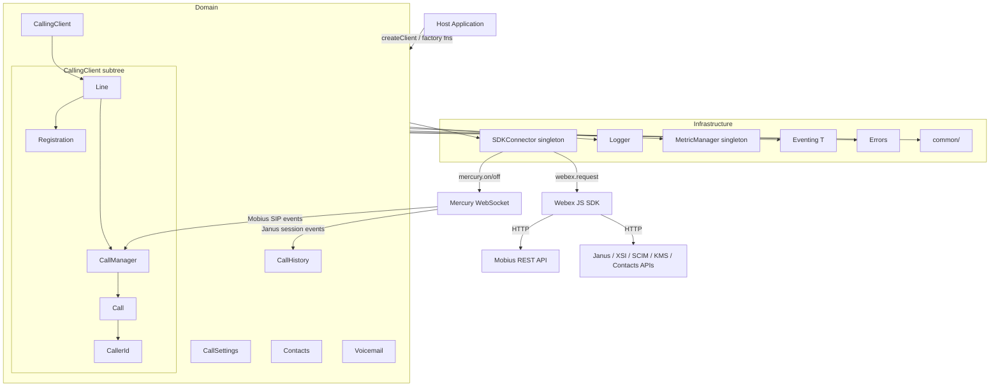
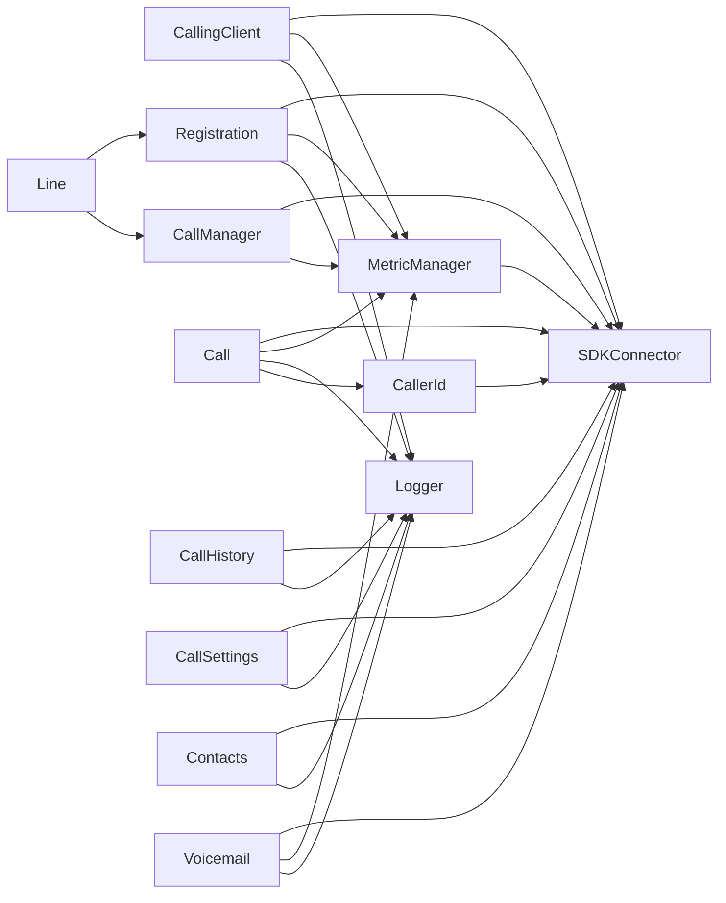

<!-- ───────────────────────────────
  Template:     ARCHITECTURE
  Template-ID:  architecture
  Generates:    ai-docs/ARCHITECTURE.md
  Description:  Repo/component architecture — components, responsibilities, interactions, cross-cutting posture.
  Library ver:  0.2.0
  Last updated: 2026-07-03
─────────────────────────────── -->

# ARCHITECTURE — @webex/calling

> Start here → root [`AGENTS.md`](../AGENTS.md) (agent entry) · router [`src/ai-docs/SPEC_INDEX.md`](../src/ai-docs/SPEC_INDEX.md). This is the system architecture; per-module detail lives in each source-local module spec.
> Context-efficiency: link to canonical docs — don't duplicate them; this loads on demand, not upfront.

## Design Overview

`@webex/calling` is a browser TypeScript SDK that provides WebRTC-based telephony on the Webex Calling platform. It is published as an npm package consumed by host web applications. The SDK is organized into two tiers: **domain modules** (CallingClient, CallHistory, CallSettings, Contacts, Voicemail) that expose the public API, and **shared infrastructure singletons** (SDKConnector, Logger, MetricManager, Eventing, Errors, common/) that every domain module depends on.

All external communication is funneled through `SDKConnector`: HTTP requests go through `webex.request()` and real-time server events arrive via the Webex Mercury WebSocket. This single gateway means no domain module holds a direct reference to the Webex SDK, enabling clean testability and a consistent auth/transport layer.

Call state is modeled with two concurrent **XState FSMs** per `Call` instance (call progress state machine + media ROAP state machine), giving explicit, testable state transition logic instead of nested conditionals. Registration uses a **Web Worker** for Mobius keepalive heartbeats so the main thread is never blocked by periodic network I/O.

## Component Inventory & Responsibilities

| Component | Responsibility (one line) | Docs |
|---|---|---|
| `src/CallingClient/` | Mobius server discovery, line/registration lifecycle, network resilience, media engine init | `src/CallingClient/ai-docs/calling-client-spec.md` |
| `src/CallingClient/line/` | Registration lifecycle API and call initiation on behalf of a single device | `src/CallingClient/line/ai-docs/line-spec.md` |
| `src/CallingClient/registration/` | Mobius device registration protocol, Web Worker keepalive, 429 retry paths | `src/CallingClient/registration/ai-docs/registration-spec.md` |
| `src/CallingClient/calling/` | Call and CallManager — XState call/ROAP FSMs, Mobius event routing, call lifecycle | `src/CallingClient/calling/ai-docs/calling-sub-spec.md` |
| `src/CallingClient/calling/CallerId/` | Caller identity resolution: SIP header priority + async SCIM enrichment | `src/CallingClient/calling/CallerId/ai-docs/caller-id-spec.md` |
| `src/CallHistory/` | Call history fetch, update missed calls, delete, real-time Janus session events | `src/CallHistory/ai-docs/call-history-spec.md` |
| `src/CallSettings/` | Call waiting, DND, call forwarding, voicemail settings (WXC/UCM strategy) | `src/CallSettings/ai-docs/call-settings-spec.md` |
| `src/Contacts/` | CRUD for contacts and groups with KMS encryption and SCIM resolution | `src/Contacts/ai-docs/contacts-spec.md` |
| `src/Voicemail/` | Voicemail list, content, transcripts, read/delete (WXC/BWRKS/UCM) | `src/Voicemail/ai-docs/voicemail-spec.md` |
| `src/Metrics/` | Singleton telemetry dispatcher — submits all SDK behavioral events | `src/Metrics/ai-docs/metrics-spec.md` |
| `src/SDKConnector/` | Singleton bridge to Webex SDK: HTTP requests + Mercury WebSocket listener registration | `src/SDKConnector/index.ts`, `types.ts` |
| `src/Logger/` | Leveled structured logging wrapper (`CALLING_SDK:` prefix) | `src/Logger/index.ts`, `types.ts` |
| `src/Events/` | `Eventing<T>` typed EventEmitter base class + all event type maps | `src/Events/types.ts`, `impl/index.ts` |
| `src/Errors/` | Error hierarchy: `ExtendedError` → `CallError` / `LineError` / `CallingClientError` | `src/Errors/catalog/`, `types.ts` |
| `src/common/` | Shared types, constants, utilities (backend detection, error handlers, SCIM, XSI) | `src/common/Utils.ts`, `types.ts`, `constants.ts` |

## Component Interaction



**Main paths:**
- **Registration:** App → `createClient` → CallingClient → Line → Registration → Mobius POST /devices → Web Worker keepalive
- **Outbound call:** App → `line.makeCall()` → CallManager → Call FSM → Mobius POST /calls + MediaEngine SDP
- **Inbound call:** Mercury `event:mobius` → SDKConnector callback → CallManager → new Call → CallerId.resolve → Line `INCOMING_CALL` event → App
- **Call history:** App → `getCallHistoryData` → Janus REST; Mercury `event:janus.*` → CallHistory → App event

## Execution & Flow (Init & Call Flow)

**SDK initialization:**
```
createClient(webex, config)
  → CallingClient.init()
  → [Windows Chromium only] ICE warmup
  → ds.ciscospark.com region discovery
  → Mobius getMobiusServers(region) → {primary, backup}
  → createLine(userId, deviceUri, mobiusUris)
  → App calls line.register() explicitly
  → Registration.triggerRegistration() → POST /devices → 200
  → Web Worker KEEPALIVE started
  → line emits LINE_EVENTS.REGISTERED
```

**Call lifecycle (outbound):**
```
line.makeCall(dest)
  → CallManager.createCall(dest, line)
  → new Call(OUTBOUND, ...) + init 2 XState FSMs
  → Call FSM: E_SEND_CALL_SETUP
  → MediaEngine.createOffer() → SDP
  → Mobius POST /calls
  → Mercury: callConnected → Call FSM: E_RECV_CALL_CONNECT
  → MediaEngine.setRemoteOffer(SDP answer)
  → emit CALL_EVENT_KEYS.CONNECT
```

## Dependencies

| Dependency | Type | How used | Failure / version handling |
|---|---|---|---|
| `@webex/internal-media-core` | peer | WebRTC SDP/media engine; `Call` creates `RoapMediaConnection` | Media failure → `call:disconnect`; peer ≥ 2.22.1 |
| `xstate` | external | Call state machine + ROAP media state machine | FSM errors propagate as call errors; pin 4.30.6 |
| `async-mutex` | external | Registration and line creation critical sections | Deadlock is not expected; single-consumer pattern |
| `typed-emitter` | external | Compile-time type safety on `EventEmitter` | No runtime fallback; TypeScript enforces at build |
| `uuid` | external | `correlationId` and `lineId` generation | No fallback needed; standard v4 |
| `Webex JS SDK` | peer | HTTP requests, Mercury WebSocket, auth, encryption | All transport failures surface as errors/events |
| `SCIM API` | external | Contact CLOUD type resolution, CallerId enrichment | SCIM failures are non-fatal; returns un-enriched data |
| `KMS (Webex encryption)` | external | Contacts/group field encryption/decryption | KMS failure surfaces as ContactResponse error |

### State Model

In-memory state per session (not persisted):

| State owner | What it holds | Trigger |
|---|---|---|
| `CallingClient` | `lineDict: Record<lineId, ILine>`, `isNetworkDown: boolean` | Created in `init()`; network events update flag |
| `CallManager` | `callCollection: Record<correlationId, ICall>` | Added on `createCall`; deleted via `DeleteRecordCallBack` |
| `Call` | XState call FSM state + ROAP FSM state, `correlationId`, `callerInfo` | FSM transitions on Mobius/Media events |
| `Registration` | `primaryServers[]`, `backupServers[]`, `status: RegistrationStatus` | Set during `init()`; updated on registration outcomes |
| `ContactsClient` | `contacts[]`, `groups[]`, `encryptionKeyUrl`, `defaultGroupId` | Populated on `getContacts()`; updated on CRUD |
| `VoicemailClient` | `sessionStorage` cache (WXC voicemail list) | Populated on first `getVoicemailList()`; invalidated on delete |

## Cross-Cutting Concerns

- **Security:** Auth is entirely delegated to the Webex SDK (`SDKConnector` wraps `webex.request()`). No tokens are stored, constructed, or logged by the calling SDK. KMS handles contact encryption. Credentials are never hardcoded (see `RULES.md` Secrets Policy). Input validation at public API boundaries (e.g., destination addresses, contactId presence for CLOUD contacts).
- **Observability:** Structured logs with `CALLING_SDK:` prefix + UTC timestamp + `{file, method}` context (see `RULES.md` Logging). Telemetry via `MetricManager` singleton covering: registration, calls, media, voicemail, BNR, connection events. No distributed tracing; `trackingId` from Mobius responses is included in registration metrics.

## Footprint & Compatibility

- **Browser-only** — uses `window`, `Worker`, `sessionStorage`, `fetch`, `DOMParser`, `RTCPeerConnection`. Not Node.js compatible.
- **No SSR** — relies on browser globals; do not import in server-side render contexts.
- **Bundle footprint** — `xstate` and `@webex/internal-media-core` are the largest contributors. Tree-shaking is supported via named exports from `src/api.ts`.
- **Semver:** follows semantic versioning; breaking changes (public interface removal/rename) require a major bump.

## Dependency / Interaction Topology



| From | To | Kind | Purpose |
|---|---|---|---|
| All domain modules | `SDKConnector` | call | HTTP requests + Mercury listeners |
| All domain modules | `Logger` | call | Structured log output |
| CallingClient, Registration, Call, Voicemail | `MetricManager` | call | Telemetry submission |
| Mercury | `CallManager` | event | Mobius SIP events (`event:mobius`) |
| Mercury | `CallHistory` | event | Janus session events (`event:janus.*`) |
| `Call` | `CallerId` | call (async) | Async SCIM enrichment post-incoming-call-create |
| Registration | Web Worker | message | `KEEPALIVE` / `CLEAR_KEEPALIVE` |

## Caching Catalog

| Cache | Backend | What it holds | Invalidation trigger |
|---|---|---|---|
| Voicemail list (WXC) | `sessionStorage` | Full voicemail message list | `delete()` removes entry; `sessionStorage` cleared on browser session end |
| Encryption key URL (Contacts) | In-memory (`this.encryptionKeyUrl`) | KMS key URL for current session | Never re-fetched once set; cleared on page reload |
| CallerID SCIM result | None (fire-and-forget) | N/A — emitted as event, not cached | N/A |
| Mobius server list | In-memory (`Registration`) | Primary + backup Mobius URLs | Refreshed on re-registration after network recovery |

## Observability Patterns

- **Logging:** `CALLING_SDK: <UTC>: [LEVEL]: file:<f> - method:<m> - message:<msg>` — all via `Logger` module; never `console.*`. Log level set by app at init via `setLogger()`.
- **Metrics:** `MetricManager.submit*Metric()` — five categories: call, registration, voicemail, BNR, connection. Submission is fire-and-forget; analytics backend is the Calling Analytics API.
- **Audit:** No dedicated audit log; registration success/failure and call setup events are captured in metrics.

## Release & Versioning

Published to npm as `@webex/calling`. Follows semantic versioning. Deprecations carry one minor-version notice window before removal. Public API is defined by `src/api.ts` exports; anything not exported from `api.ts` is internal and may change without a major bump.

## Cross-Repo Dependency Graph

- **Internal (same monorepo):** `packages/calling` depends on `@webex/internal-media-core` (media engine), Webex JS SDK core packages, and shared `@webex/jest-config-legacy` for test config.
- **External services:** Mobius REST API (registration + call control), Mercury WebSocket (real-time events), Janus REST API (call history), SCIM API (contact + caller ID resolution), Webex KMS (contact encryption), XSI Actions API (CallSettings WXC call waiting).

---
→ Per-module orientation and detailed design live in each source-local module spec. Routing: [`src/ai-docs/SPEC_INDEX.md`](../src/ai-docs/SPEC_INDEX.md).

## Architecture Reference Links

| Reference | Location | When to read |
|---|---|---|
| Enforceable rules | `ai-docs/RULES.md` | Every change; gate before merge |
| Architecture patterns | `ai-docs/patterns/architecture-patterns.md` | When adding singletons, factories, or backend connectors |
| Error handling patterns | `ai-docs/patterns/error-handling-patterns.md` | When adding or changing error flows |
| Event patterns | `ai-docs/patterns/event-patterns.md` | When adding new events or Mercury listeners |
| TypeScript patterns | `ai-docs/patterns/typescript-patterns.md` | When defining new types, interfaces, or enums |
| Testing patterns | `ai-docs/patterns/testing-patterns.md` | When writing or reviewing tests |
| Module specs | `src/ai-docs/SPEC_INDEX.md` | Per-module requirements, flows, and pitfalls |
