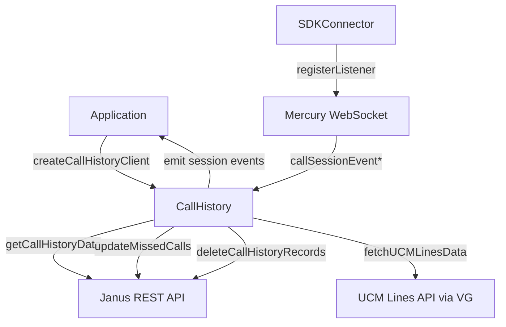
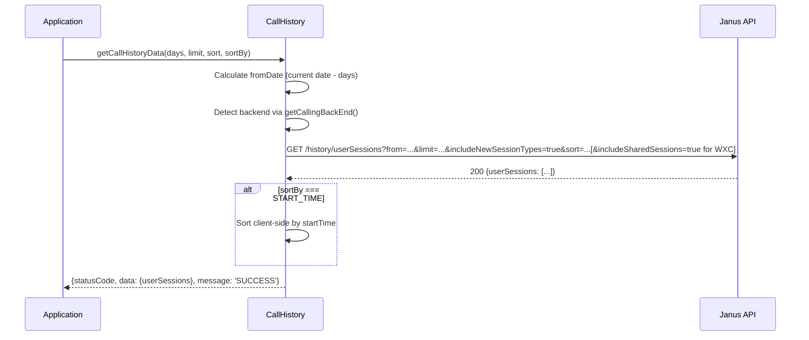
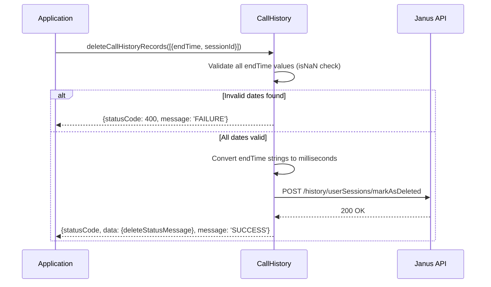
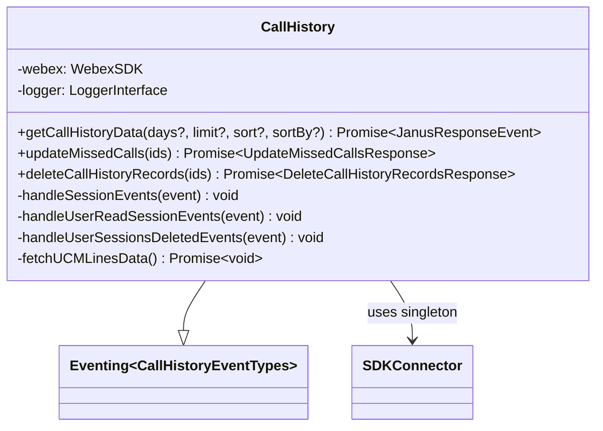

<!-- ───────────────────────────────
  Template:     Module Spec
  Template-ID:  module-spec
  Generates:    packages/calling/src/CallHistory/ai-docs/call-history-spec.md
  Description:  Canonical spec for the CallHistory module.
  Library ver:  0.2.0
  Last updated: 2026-07-03
─────────────────────────────── -->

# CallHistory — SPEC

> Start here → root [`AGENTS.md`](../../../AGENTS.md) (agent entry) · router [`SPEC_INDEX.md`](../../ai-docs/SPEC_INDEX.md) · system [`calling-spec.md`](../../ai-docs/calling-spec.md). This is the CallHistory canonical spec.
> Context-efficiency: link to canonical docs — don't duplicate them.

## Metadata

| Field | Value |
|---|---|
| Module id | `CallHistory` |
| Source path(s) | `packages/calling/src/CallHistory/` |
| Doc kind | Module spec |
| Coverage score | Specced |
| Generated from | `module-spec` @ SDLC template library `0.2.0` |
| generated_by / approved_by / updated_at | migrated from `CallHistory/ai-docs/AGENTS.md` + `ARCHITECTURE.md` / pending / 2026-07-03 |
| Validation status | not-run |

## Evidence Rules

Every requirement cites `file path`. Test evidence preferred for WHY.

## Source Material Register

| Source doc | Scope | Decision | Detail location or disposition |
|---|---|---|---|
| `CallHistory/ai-docs/AGENTS.md` | overview, public API, config, examples | migrated | Overview, Public Surface, Configuration, Use Cases |
| `CallHistory/ai-docs/ARCHITECTURE.md` | component table, data flows, sequence diagrams, constants | migrated | Design Overview, Data Flow, Sequence Diagrams, Key Files |

## Overview

The `CallHistory` module provides APIs for retrieving, managing, and receiving real-time updates for call history records. It supports fetching paginated and sorted history, marking missed calls as read, deleting records, and receiving real-time session events via Mercury WebSocket.

For WXC backend, shared session types (`WEBEXCALLING_SHARED`) are included via `includeSharedSessions=true`. For UCM, records are enriched with `ucmLineNumber` by matching `self.cucmDN` against the UCM Lines API.

**Factory:** `createCallHistoryClient(webex, logger) → ICallHistory`

## Purpose / Responsibility

Owns retrieval and management of call history records from Janus, and forwarding of real-time call session events from Mercury to the application. Does NOT own call control or registration.

## Stack

TypeScript, Jest/jsdom. No special runtime deps beyond the Webex SDK.

## Folder / Package Structure

```
CallHistory/
├── CallHistory.ts              # Main class with all public APIs
├── CallHistory.test.ts         # Unit tests
├── types.ts                    # ICallHistory, JanusResponseEvent, response types
├── constants.ts                # Endpoints, defaults
├── callHistoryFixtures.ts      # Test fixtures
└── ai-docs/
    ├── call-history-spec.md    # This file (canonical spec)
    ├── AGENTS.md               # Original agent doc (source material)
    └── ARCHITECTURE.md         # Original architecture doc (source material)
```

## Key Files (source of truth)

| File | Holds |
|---|---|
| `CallHistory.ts` | All public API methods, Mercury listener registration, UCM enrichment |
| `types.ts` | `ICallHistory`, `JanusResponseEvent`, `UpdateMissedCallsResponse`, `DeleteCallHistoryRecordsResponse`, `EndTimeSessionId` |
| `constants.ts` | `NUMBER_OF_DAYS` (10), `LIMIT` (50), `FROM_DATE` (`'?from'`), Mercury event keys, endpoint segments |

## Public Surface

| Contract ID | Type | Surface | Purpose | Compatibility | Schema / detail link | Root index |
|---|---|---|---|---|---|---|
| `CallHistory.getCallHistoryData` | SDK | `getCallHistoryData(days?, limit?, sort?, sortBy?): Promise<JanusResponseEvent>` | Fetch call history from Janus | stable | `CallHistory/types.ts#ICallHistory` | `SPEC_INDEX.md` |
| `CallHistory.updateMissedCalls` | SDK | `updateMissedCalls(endTimeSessionIds): Promise<UpdateMissedCallsResponse>` | Mark missed calls read | stable | `CallHistory/types.ts#ICallHistory` | `SPEC_INDEX.md` |
| `CallHistory.deleteCallHistoryRecords` | SDK | `deleteCallHistoryRecords(deleteSessionIds): Promise<DeleteCallHistoryRecordsResponse>` | Delete call history records | stable | `CallHistory/types.ts#ICallHistory` | `SPEC_INDEX.md` |
| `CallHistory.on(callHistory:user_recent_sessions)` | event | `CallSessionEvent` | New/updated session pushed by Janus via Mercury | stable | `src/Events/types.ts#COMMON_EVENT_KEYS` | `SPEC_INDEX.md` |
| `CallHistory.on(callHistory:user_viewed_sessions)` | event | `CallSessionViewedEvent` | Sessions marked as viewed | stable | `src/Events/types.ts#COMMON_EVENT_KEYS` | `SPEC_INDEX.md` |
| `CallHistory.on(callHistory:user_sessions_deleted)` | event | `CallSessionDeletedEvent` | Sessions deleted | stable | `src/Events/types.ts#COMMON_EVENT_KEYS` | `SPEC_INDEX.md` |

## Requires (dependencies)

- **Internal**: `SDKConnector` (singleton), `Eventing<CallHistoryEventTypes>` (base class), `Logger`, `serviceErrorCodeHandler`, `getVgActionEndpoint`, `getCallingBackEnd`, `uploadLogs`
- **External**: Janus REST API (call history), Mercury WebSocket (real-time events), UCM Lines API (enrichment)

## Requirements

| ID | WHAT | WHY | Source Evidence | Test / Example Evidence | Assumptions / Gaps | Confidence |
|---|---|---|---|---|---|---|
| `CH-R-001` | `getCallHistoryData()` MUST append `includeNewSessionTypes=true` to every Janus request | Required by Janus to return all session types including new formats | `CallHistory.ts`, `constants.ts` | `CallHistory.test.ts` | none | PRESENT |
| `CH-R-002` | For WXC backend, `getCallHistoryData()` MUST append `includeSharedSessions=true` | Shared session types (`WEBEXCALLING_SHARED`) are WXC-specific | `CallHistory.ts` | `CallHistory.test.ts` — WXC path | none | PRESENT |
| `CH-R-003` | `updateMissedCalls()` and `deleteCallHistoryRecords()` MUST use browser `fetch` with manual `Authorization` header, NOT `webex.request()` | These are POST endpoints that require manual auth token injection | `CallHistory.ts` (implementation) | `CallHistory.test.ts` | none | PRESENT |
| `CH-R-004` | `deleteCallHistoryRecords()` MUST validate all `endTime` values before calling Janus; invalid dates MUST return `statusCode: 400` | Malformed dates cause Janus server errors; client-side validation prevents unnecessary requests | `CallHistory.ts` (validation logic) | `CallHistory.test.ts` — invalid date tests | none | PRESENT |
| `CH-R-005` | `endTime` values MUST be converted from ISO string to milliseconds (epoch) before sending to Janus endpoints | Janus API expects epoch milliseconds, not ISO strings | `CallHistory.ts` (endTime conversion) | `CallHistory.test.ts` | none | PRESENT |
| `CH-R-006` | Constructor MUST register four Mercury listeners on construction: `callSessionEventInclusive`, `callSessionEventLegacy`, `callSessionEventViewed`, `callSessionEventDeleted` | Real-time event delivery requires listener registration at module init | `CallHistory.ts` (constructor) | `CallHistory.test.ts` — event listener tests | none | PRESENT |
| `CH-R-007` | For UCM backend, `getCallHistoryData()` MUST enrich records with `ucmLineNumber` by matching `cucmDN` against UCM Lines API; UCM enrichment failure MUST NOT fail the overall response | UCM line numbers help users identify which line a call came from; enrichment is best-effort | `CallHistory.ts` (fetchUCMLinesData) | `CallHistory.test.ts` — UCM enrichment path | none | PRESENT |
| `CH-R-008` | `sortBy === SORT_BY.START_TIME` sorting MUST be performed client-side after fetch; `sort` parameter is sent to Janus only as a URL param affecting Janus's ordering, not the `sortBy` field | Janus does not support `sortBy=startTime`; client applies it post-fetch | `CallHistory.ts` | `CallHistory.test.ts` — sort tests | none | PRESENT |

## Design Overview

`CallHistory` is a single-class module wrapping the Janus API. The class constructor registers Mercury listeners for session events and exposes three API methods. All HTTP uses two different clients: `webex.request()` for GET (auto-auth), browser `fetch` for POST (manual auth). Backend detection at construction gates WXC vs UCM behavior.

## Data Flow



## Sequence Diagram(s)

Sequence coverage:

| Operation group | Diagram | Failure / recovery coverage |
|---|---|---|
| Fetch call history (WXC) | WXC fetch sequence | Covered in requirements |
| Fetch with UCM enrichment | UCM enrichment sequence | Enrichment failure is non-fatal |
| Update missed calls | Update sequence | Invalid date → 400 |
| Delete records | Delete sequence | Invalid date → 400 client-side |
| Real-time events | Event sequence | Mercury disconnect → no events |





## Class / Component Relationships



## Use Cases

- **UC-1 Fetch last 10 days of history:** `getCallHistoryData(10, 50, SORT.DESC, SORT_BY.END_TIME)`. Evidence: `CallHistory.ts`, `CallHistory.test.ts`.
- **UC-2 Mark missed calls as read:** `updateMissedCalls([{endTime: '2024-01-15T10:30:00.000Z', sessionId: 'uuid'}])`. Evidence: `CallHistory.ts`.
- **UC-3 Delete records:** `deleteCallHistoryRecords([{endTime, sessionId}])` — validates dates client-side first. Evidence: `CallHistory.ts`.
- **UC-4 Real-time session updates:** `callHistory.on('callHistory:user_recent_sessions', cb)` — fires when Janus pushes updates via Mercury. Evidence: `CallHistory.ts` (constructor, handleSessionEvents).

## Business Rules & Invariants

- `FROM_DATE` constant is `'?from'` (includes the `?`) — do not prepend another `?` when building URLs.
- `includeNewSessionTypes=true` is ALWAYS appended; `includeSharedSessions=true` is WXC-ONLY.
- Body key for `updateMissedCalls` is `endTimeSessionIds`; for `deleteCallHistoryRecords` is `deleteSessionIds` — using the wrong key silently produces wrong API behavior.
- UCM enrichment failure is caught internally and logged as a warning; the main call history response is still returned.

## Error Handling & Failure Modes

| Condition | Signal | Caller recovery |
|---|---|---|
| Invalid `endTime` in `deleteCallHistoryRecords` | `statusCode: 400`, message: `'The provided date is malformed or invalid'` | Fix date format |
| Janus authentication failure | `statusCode: 401` in response | Refresh token |
| Mercury not connected | Session events never fire | Verify Mercury connection |
| UCM Lines API failure | Warning logged; `ucmLineNumber` absent on records | Non-fatal; display records without enrichment |

## Pitfalls

- `endTime` in API bodies must be **epoch milliseconds** (converted from ISO string) — sending ISO string returns Janus 400.
- `FROM_DATE` constant already includes `?` — inserting another `?` creates double-`?` URL syntax errors.
- Event payload `CallSessionEvent` has nested structure: `event.data.userSessions.userSessions` (array) — accessing `event.data.userSessions` alone gives an object, not the array.
- `updateMissedCalls` uses `fetch` (not `webex.request()`) — if the token retrieval from `webex.credentials.getUserToken()` fails, the request will fail with an auth error. New POST endpoints should follow the same `fetch`-based pattern.

## Module Do's / Don'ts

- DO: use `fetch` (not `webex.request()`) for POST endpoints (`setReadState`, `markAsDeleted`).
- DO: convert `endTime` to epoch milliseconds before POSTing.
- DO: validate dates before sending to Janus (return 400 on invalid).
- DON'T: add another `?` before `FROM_DATE` when constructing URLs.
- DON'T: use `webex.request()` for `updateMissedCalls` or `deleteCallHistoryRecords`.

## Test-Case Strategy (module)

Unit tests in `CallHistory.test.ts`. Uses `getTestUtilsWebex()`. Key coverage: fetch with/without WXC shared sessions, UCM enrichment, date validation for delete, fetch → browser fetch split, Mercury event forwarding.

| Behavior / Requirement | Existing test evidence | Gap |
|---|---|---|
| `CH-R-001` includeNewSessionTypes | `CallHistory.test.ts` | none |
| `CH-R-002` WXC includeSharedSessions | `CallHistory.test.ts` | none |
| `CH-R-003` fetch vs webex.request split | `CallHistory.test.ts` | none |
| `CH-R-004` Invalid date → 400 | `CallHistory.test.ts` | none |
| `CH-R-005` endTime epoch conversion | `CallHistory.test.ts` | none |
| `CH-R-006` Mercury listener registration | `CallHistory.test.ts` | none |
| `CH-R-007` UCM enrichment non-fatal | `CallHistory.test.ts` | none |
| `CH-R-008` Client-side sortBy | `CallHistory.test.ts` | none |

## Traceability

- Repo architecture: `../../ai-docs/calling-spec.md` · Registry: `../../ai-docs/SPEC_INDEX.md`
- Coverage state: `.sdd/manifest.json` (pending)
