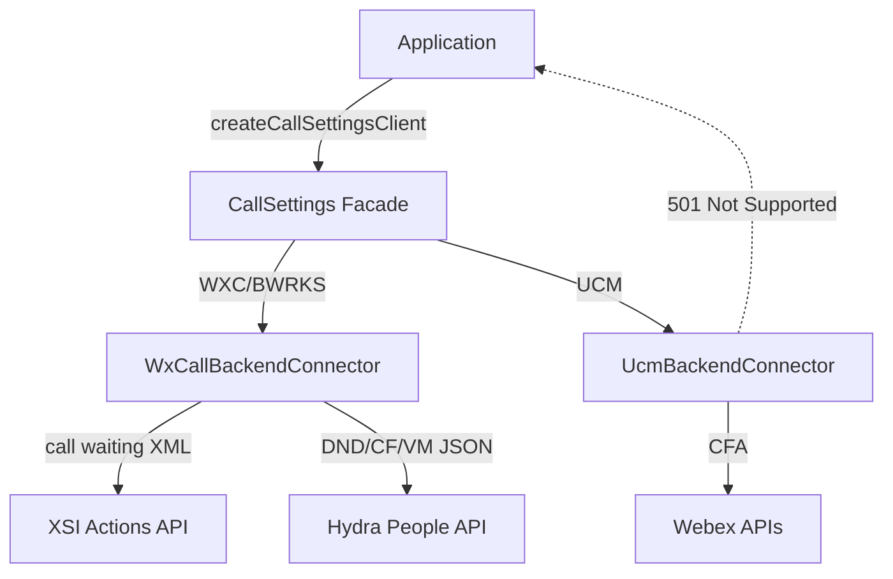
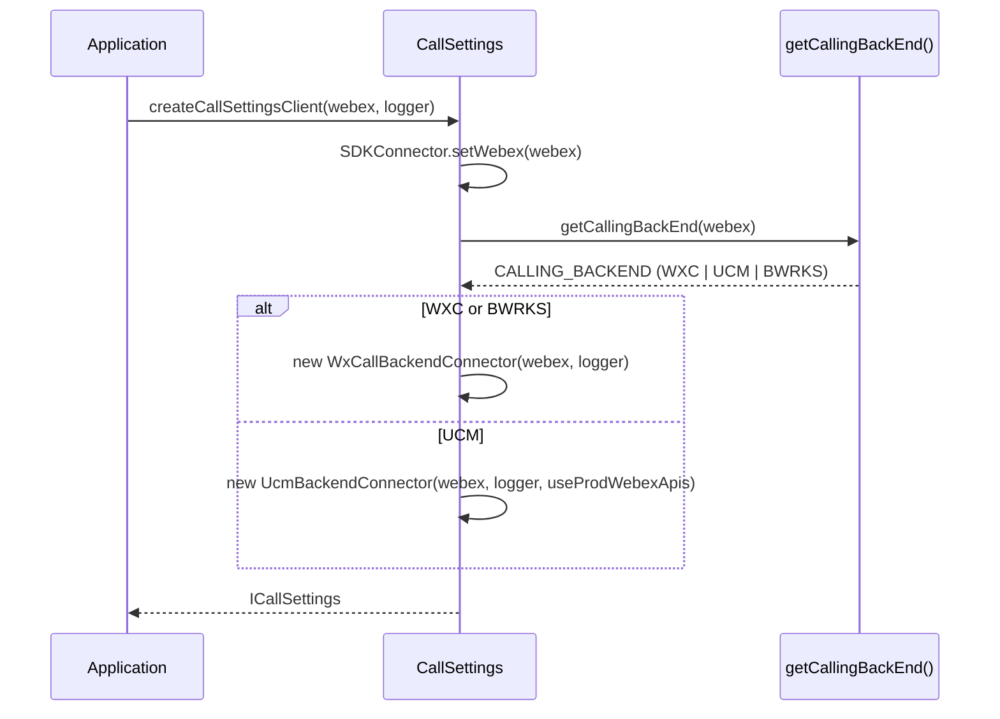
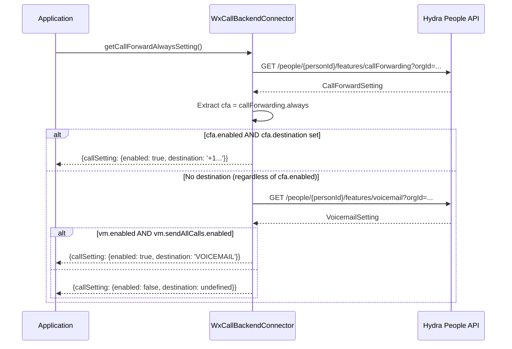
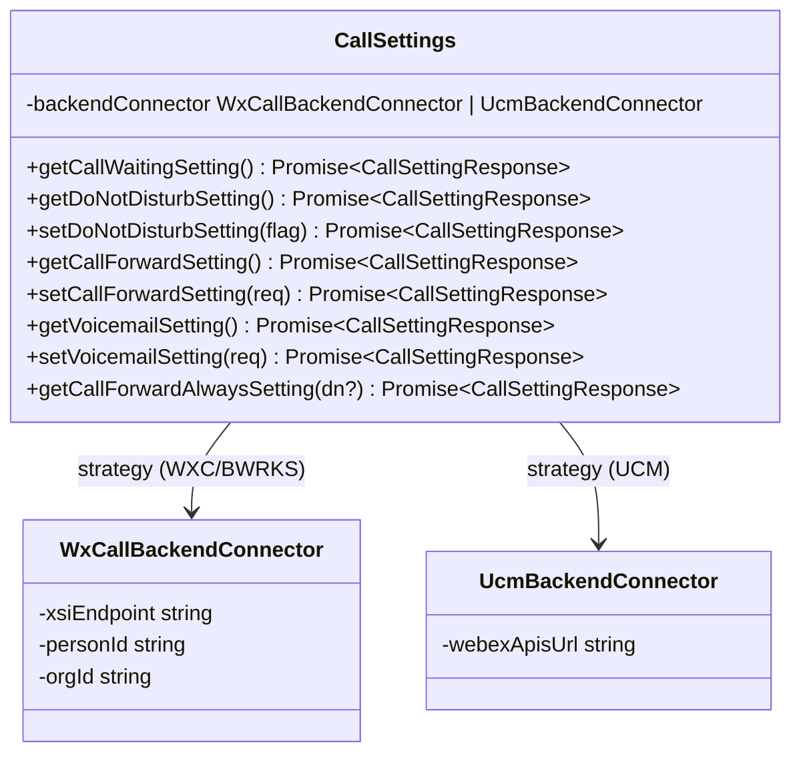

<!-- ───────────────────────────────
  Template:     Module Spec
  Template-ID:  module-spec
  Generates:    packages/calling/src/CallSettings/ai-docs/call-settings-spec.md
  Description:  Canonical spec for the CallSettings module.
  Library ver:  0.2.0
  Last updated: 2026-07-03
─────────────────────────────── -->

# CallSettings — SPEC

> Start here → root [`AGENTS.md`](../../../AGENTS.md) (agent entry) · router [`SPEC_INDEX.md`](../../ai-docs/SPEC_INDEX.md) · system [`calling-spec.md`](../../ai-docs/calling-spec.md). This is the CallSettings canonical spec.

## Metadata

| Field | Value |
|---|---|
| Module id | `CallSettings` |
| Source path(s) | `packages/calling/src/CallSettings/` |
| Doc kind | Module spec |
| Coverage score | Specced |
| Generated from | `module-spec` @ SDLC template library `0.2.0` |
| generated_by / approved_by / updated_at | migrated from `CallSettings/ai-docs/AGENTS.md` + `ARCHITECTURE.md` / pending / 2026-07-03 |
| Validation status | not-run |

## Evidence Rules

Every requirement cites `file path`. Test evidence preferred for WHY.

## Source Material Register

| Source doc | Scope | Decision | Detail location or disposition |
|---|---|---|---|
| `CallSettings/ai-docs/AGENTS.md` | overview, public API, types, examples | migrated | Overview, Public Surface, Use Cases |
| `CallSettings/ai-docs/ARCHITECTURE.md` | component table, data flows, sequence diagrams, constants | migrated | Design Overview, Data Flow, Sequence Diagrams, Pitfalls |

## Overview

`CallSettings` provides APIs for retrieving and updating user call settings: Call Waiting, Do Not Disturb (DND), Call Forwarding, Voicemail settings, and Call Forward Always. It uses a **strategy pattern** to delegate all operations to backend-specific connectors (`WxCallBackendConnector` for WXC/BWRKS, `UcmBackendConnector` for UCM) chosen at construction time.

**Factory:** `createCallSettingsClient(webex, logger, useProdWebexApis?) → ICallSettings`

## Purpose / Responsibility

Owns call settings CRUD across WXC, Broadworks, and UCM backends through a facade + strategy. Does NOT own backend type detection (delegated to `getCallingBackEnd()` in `common/Utils.ts`).

## Stack

TypeScript, Jest/jsdom. No additional runtime deps beyond Webex SDK.

## Folder / Package Structure

```
CallSettings/
├── CallSettings.ts                 # Facade class — backend detection, connector init, delegation
├── CallSettings.test.ts            # Facade unit tests
├── WxCallBackendConnector.ts       # WXC/Broadworks implementation (XSI + Hydra People API)
├── WxCallBackendConnector.test.ts  # WXC connector tests
├── UcmBackendConnector.ts          # UCM implementation (Webex API CFA; 501 for others)
├── UcmBackendConnector.test.ts     # UCM connector tests
├── types.ts                        # ICallSettings, CallSettingResponse, setting types
├── constants.ts                    # Endpoints, method names
├── testFixtures.ts                 # Test fixtures
└── ai-docs/
    ├── call-settings-spec.md       # This file (canonical spec)
    ├── AGENTS.md                   # Original agent doc
    └── ARCHITECTURE.md             # Original architecture doc
```

## Key Files (source of truth)

| File | Holds |
|---|---|
| `types.ts` | `ICallSettings`, `CallSettingResponse`, `ToggleSetting`, `CallForwardSetting`, `VoicemailSetting`, `CallForwardAlwaysSetting`, `CallForwardingSettingsUCM` |
| `constants.ts` | `DND_ENDPOINT`, `CF_ENDPOINT`, `VM_ENDPOINT`, `CALL_WAITING_ENDPOINT`, `PEOPLE_ENDPOINT`, `XSI_VERSION` |
| `WxCallBackendConnector.ts` | WXC/BWRKS method implementations; XSI XML parsing; Hydra ID inference |
| `UcmBackendConnector.ts` | UCM CFA implementation; 501 for all other methods; URL selection logic |

## Public Surface

| Contract ID | Type | Surface | Purpose | Compatibility | Schema | Root index |
|---|---|---|---|---|---|---|
| `CallSettings.getCallWaitingSetting` | SDK | `(): Promise<CallSettingResponse>` | Get call waiting status (WXC only) | stable; UCM returns 501 | `types.ts#CallSettingResponse` | `SPEC_INDEX.md` |
| `CallSettings.getDoNotDisturbSetting` | SDK | `(): Promise<CallSettingResponse>` | Get DND status | stable; UCM returns 501 | `types.ts` | `SPEC_INDEX.md` |
| `CallSettings.setDoNotDisturbSetting` | SDK | `(flag: boolean): Promise<CallSettingResponse>` | Enable/disable DND | stable; UCM returns 501 | `types.ts` | `SPEC_INDEX.md` |
| `CallSettings.getCallForwardSetting` | SDK | `(): Promise<CallSettingResponse>` | Get full call forwarding settings | stable; UCM returns 501 | `types.ts` | `SPEC_INDEX.md` |
| `CallSettings.setCallForwardSetting` | SDK | `(req: CallForwardSetting): Promise<CallSettingResponse>` | Update call forwarding settings | stable; UCM returns 501 | `types.ts` | `SPEC_INDEX.md` |
| `CallSettings.getVoicemailSetting` | SDK | `(): Promise<CallSettingResponse>` | Get voicemail configuration | stable; UCM returns 501 | `types.ts` | `SPEC_INDEX.md` |
| `CallSettings.setVoicemailSetting` | SDK | `(req: VoicemailSetting): Promise<CallSettingResponse>` | Update voicemail config | stable; UCM returns 501 | `types.ts` | `SPEC_INDEX.md` |
| `CallSettings.getCallForwardAlwaysSetting` | SDK | `(directoryNumber?: string): Promise<CallSettingResponse>` | Get CFA destination or voicemail flag | stable; UCM requires directoryNumber | `types.ts` | `SPEC_INDEX.md` |

## Requires (dependencies)

- **Internal**: `SDKConnector` (singleton), `Logger`, `getCallingBackEnd`, `getXsiActionEndpoint`, `inferIdFromUuid`, `serviceErrorCodeHandler`, `uploadLogs`
- **External**: XSI Actions API (WXC call waiting), Hydra People API (WXC DND/CF/VM), Webex APIs (UCM CFA)

## Requirements

| ID | WHAT | WHY | Source Evidence | Test / Example Evidence | Assumptions / Gaps | Confidence |
|---|---|---|---|---|---|---|
| `CS-R-001` | `CallSettings` facade MUST select connector at construction using `getCallingBackEnd(webex)` — WXC/BWRKS gets `WxCallBackendConnector`, UCM gets `UcmBackendConnector` | Backend-specific APIs differ fundamentally; strategy pattern hides this from callers | `CallSettings.ts` (initializeBackendConnector) | `CallSettings.test.ts` | none | PRESENT |
| `CS-R-002` | `getCallWaitingSetting()` on WXC MUST use browser `fetch` with `Authorization: Bearer {getUserToken()}` and parse the XML response via `DOMParser` | XSI Actions API returns XML, not JSON; requires manual auth | `WxCallBackendConnector.ts` | `WxCallBackendConnector.test.ts` | none | PRESENT |
| `CS-R-003` | All DND/CF/VM methods on WXC MUST use `webex.request()` against the Hydra People API with Hydra-encoded `personId` and `orgId` | Hydra People API accepts JSON and handles auth via SDK | `WxCallBackendConnector.ts` | `WxCallBackendConnector.test.ts` | none | PRESENT |
| `CS-R-004` | `getCallForwardAlwaysSetting()` on WXC MUST implement composite logic: check CF settings first; fall through to voicemail check if CFA destination is absent | CFA can be set to voicemail via `sendAllCalls.enabled`; simple CF check misses this | `WxCallBackendConnector.ts` (getCallForwardAlwaysSetting) | `WxCallBackendConnector.test.ts` | none | PRESENT |
| `CS-R-005` | All UCM methods EXCEPT `getCallForwardAlwaysSetting` MUST return `statusCode: 501` | UCM backend only supports CFA query; returning 501 is intentional per API contract | `UcmBackendConnector.ts` | `UcmBackendConnector.test.ts` | none | PRESENT |
| `CS-R-006` | UCM `getCallForwardAlwaysSetting(directoryNumber)` MUST return `statusCode: 400` when `directoryNumber` is absent | UCM requires DN to identify which line to query; omitting it is a programming error | `UcmBackendConnector.ts` | `UcmBackendConnector.test.ts` | none | PRESENT |
| `CS-R-007` | UCM connector MUST lowercase `CF_ENDPOINT` (`features/callforwarding`) in URL construction | UCM API path is lowercase while WXC uses camelCase `callForwarding` | `UcmBackendConnector.ts` (.toLowerCase() usage) | `UcmBackendConnector.test.ts` | none | PRESENT |
| `CS-R-008` | UCM directory number matching MUST use `endsWith()` against both `dn` and `e164Number` fields | Partial DN matching is a UCM convention (last N digits) | `UcmBackendConnector.ts` | `UcmBackendConnector.test.ts` | none | PRESENT |

## Design Overview

Strategy pattern: `CallSettings` facade detects backend at construction, instantiates the correct connector, and delegates every call. `WxCallBackendConnector` implements the full interface (XSI for call waiting, Hydra for others). `UcmBackendConnector` implements only `getCallForwardAlwaysSetting` (Webex API) and returns 501 for all others. The WXC connector eagerly converts device UUIDs to Hydra-format IDs at construction.

## Data Flow



## Sequence Diagram(s)

Sequence coverage:

| Operation group | Diagram | Failure / recovery coverage |
|---|---|---|
| Backend connector init | Init sequence | INVALID backend → error |
| Get call waiting (WXC) | XSI sequence | XSI endpoint not resolvable |
| Get CFA (WXC composite) | CFA composite sequence | Voicemail fallthrough path |
| Get CFA (UCM) | UCM CFA sequence | 400 on missing DN, 404 on no match |





## Class / Component Relationships



## Use Cases

- **UC-1 Get DND status:** `callSettings.getDoNotDisturbSetting()` → `{enabled: bool}`. Evidence: `WxCallBackendConnector.ts`, `WxCallBackendConnector.test.ts`.
- **UC-2 Set call forwarding:** `callSettings.setCallForwardSetting({callForwarding: {always: {enabled: true, destination: '+1...'}}})`. Evidence: `WxCallBackendConnector.ts`.
- **UC-3 Get CFA for UCM:** `callSettings.getCallForwardAlwaysSetting('1234')` — requires directory number on UCM. Evidence: `UcmBackendConnector.ts`.

## Business Rules & Invariants

- `WxCallBackendConnector` converts `userId` and `orgId` to Hydra IDs at construction using `inferIdFromUuid()` — these IDs are fixed for the connector lifetime.
- UCM `always` in `CallForwardingSettingsUCM` is an **array** (multiple lines) vs WXC's single object — do not access UCM response as WXC object.
- UCM API URL depends on `webex.config.fedramp` and `useProdWebexApis` flag: fedramp → `api-usgov.webex.com`, prod → `webexapis.com`, integration → `integration.webexapis.com`. Evidence: `UcmBackendConnector.ts`.
- XSI endpoint for call waiting is lazily resolved on first call and cached in `this.xsiEndpoint`.

## Error Handling & Failure Modes

| Condition | Signal | Caller recovery |
|---|---|---|
| UCM unsupported method | `statusCode: 501` | Expected — document feature as WXC-only |
| UCM missing `directoryNumber` | `statusCode: 400` | Pass the user's directory number |
| UCM no matching DN | `statusCode: 404` | Verify the DN is assigned to the user |
| XSI endpoint unresolvable | Error in `CallSettingResponse.data.error` | Check user provisioning |
| Token expired | `statusCode: 401` | Refresh token |

## Pitfalls

- UCM `getCallForwardAlwaysSetting()` uses `endsWith()` matching — partial DN (last 4 digits) is valid but could match the wrong line if multiple lines share a suffix.
- UCM URL uses `features/callforwarding` (lowercase) due to `.toLowerCase()` on `CF_ENDPOINT` — WXC uses `features/callForwarding`. Mixing them up breaks the URL.
- `getCallForwardAlwaysSetting()` on WXC does NOT simply read `callForwarding.always.enabled` — it checks `destination` first, then falls back to voicemail `sendAllCalls.enabled`. The enabled flag alone is not sufficient.
- All UCM methods except `getCallForwardAlwaysSetting` return 501 — this is intentional, not a bug.

## Test-Case Strategy (module)

Unit tests in `CallSettings.test.ts` (facade), `WxCallBackendConnector.test.ts`, `UcmBackendConnector.test.ts`. Key coverage: backend selection, XML parsing for call waiting, CFA composite logic, UCM 501 returns, UCM DN matching.

| Behavior / Requirement | Existing test evidence | Gap |
|---|---|---|
| `CS-R-001` Backend connector selection | `CallSettings.test.ts` | none |
| `CS-R-002` Call waiting XSI + fetch | `WxCallBackendConnector.test.ts` | none |
| `CS-R-003` Hydra API methods | `WxCallBackendConnector.test.ts` | none |
| `CS-R-004` CFA composite logic | `WxCallBackendConnector.test.ts` | none |
| `CS-R-005` UCM 501 returns | `UcmBackendConnector.test.ts` | none |
| `CS-R-006` UCM missing DN → 400 | `UcmBackendConnector.test.ts` | none |
| `CS-R-007` UCM lowercase CF_ENDPOINT | `UcmBackendConnector.test.ts` | none |
| `CS-R-008` UCM endsWith matching | `UcmBackendConnector.test.ts` | none |

## Traceability

- Repo architecture: `../../ai-docs/calling-spec.md` · Registry: `../../ai-docs/SPEC_INDEX.md`
- Coverage state: `.sdd/manifest.json` (pending)
