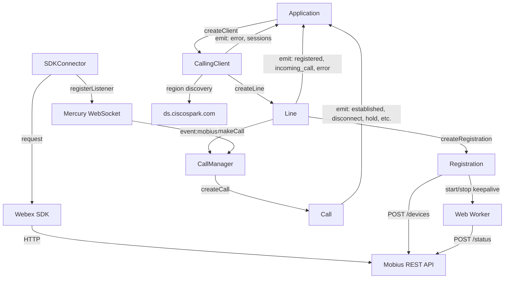
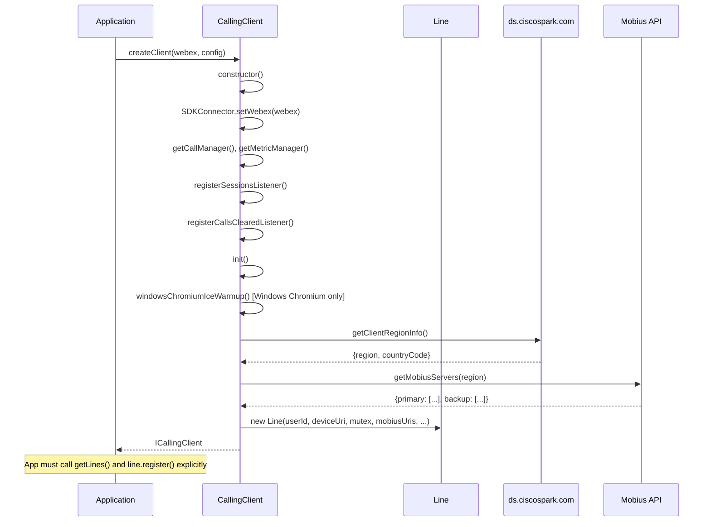
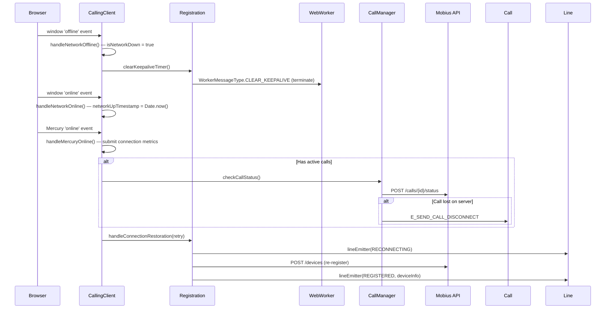
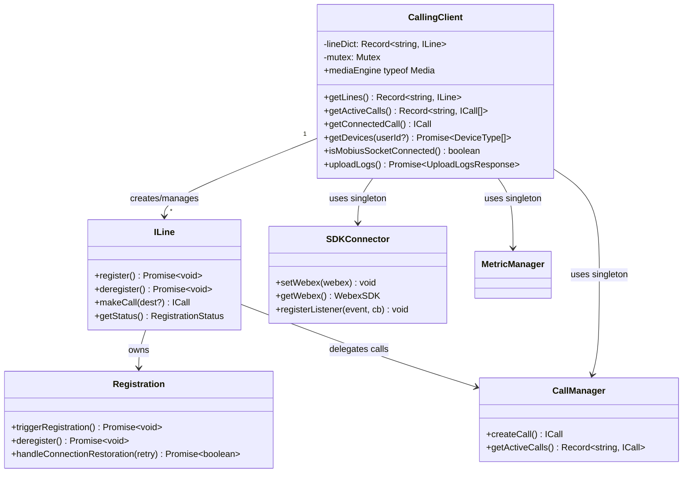

<!-- ───────────────────────────────
  Template:     Module Spec
  Template-ID:  module-spec
  Generates:    packages/calling/src/CallingClient/ai-docs/calling-client-spec.md
  Description:  Canonical spec for the CallingClient module — registration, call lifecycle, Mobius discovery, network resilience.
  Library ver:  0.2.0
  Last updated: 2026-07-03
─────────────────────────────── -->

# CallingClient — SPEC

> Start here → root [`AGENTS.md`](../../../AGENTS.md) (agent entry) · router [`SPEC_INDEX.md`](../../ai-docs/SPEC_INDEX.md) · system [`calling-spec.md`](../../ai-docs/calling-spec.md). This is the CallingClient canonical spec.
> Context-efficiency: link to canonical docs — don't duplicate them.

## Metadata

| Field | Value |
|---|---|
| Module id | `CallingClient` |
| Source path(s) | `packages/calling/src/CallingClient/` |
| Doc kind | Module spec |
| Coverage score | Specced |
| Generated from | `module-spec` @ SDLC template library `0.2.0` |
| generated_by / approved_by / updated_at | migrated from `CallingClient/ai-docs/AGENTS.md` + `ARCHITECTURE.md` / pending / 2026-07-03 |
| Validation status | not-run |

## Evidence Rules

Every requirement cites `file path`. Test evidence preferred for WHY.

## Source Material Register

| Source doc | Scope | Decision | Detail location or disposition |
|---|---|---|---|
| `CallingClient/ai-docs/AGENTS.md` | overview, public API, config, examples | migrated | Overview, Public Surface, Configuration, Use Cases |
| `CallingClient/ai-docs/ARCHITECTURE.md` | component table, data flows, sequence diagrams, constants, troubleshooting | migrated | Design Overview, Data Flow, Sequence Diagrams, Pitfalls |

## Overview

`CallingClient` is the top-level orchestrator for Webex Calling line registration and call control. It discovers optimal Mobius servers, creates and manages Line objects, handles network resilience (browser `online`/`offline` events + Mercury reconnection), and mediates access to the media engine.

Applications create a `CallingClient` via `createClient(webex, config?)` which calls `init()` internally. `init()` runs ICE warmup (Windows Chromium only), performs region-based Mobius discovery, and creates a Line. The application must then call `line.register()` explicitly — `init()` does NOT auto-register.

## Purpose / Responsibility

Owns Mobius server discovery, Line/Registration lifecycle management, network resilience, and media engine initialization. Does NOT own the detailed registration protocol (delegated to `Registration`) or call signaling FSM (delegated to `Call`/`CallManager`).

## Stack

TypeScript, Jest/jsdom. Key deps: `@webex/internal-media-core` (media engine), `async-mutex` (concurrency), `xstate` (via Call).

## Folder / Package Structure

```
CallingClient/
├── CallingClient.ts                    # Main orchestrator class
├── CallingClient.test.ts               # Unit tests
├── types.ts                            # ICallingClient, CallingClientConfig
├── constants.ts                        # Mobius URLs, timeouts, timer constants
├── callingClientFixtures.ts            # Test fixtures
├── callRecordFixtures.ts               # Call record fixtures
├── windowsChromiumIceWarmupUtils.ts    # ICE warmup for Windows Chromium
├── line/                               # Line management sub-module
├── registration/                       # Registration sub-module
└── calling/                            # Call, CallManager, CallerId sub-module
```

## Key Files (source of truth)

| File | Holds |
|---|---|
| `CallingClient.ts` | Orchestrator logic, Mobius discovery, network event handlers, session listeners |
| `types.ts` | `ICallingClient`, `CallingClientConfig` — authoritative public interface |
| `constants.ts` | `DEFAULT_KEEPALIVE_INTERVAL`, `REG_TRY_BACKUP_TIMER_VAL_IN_SEC`, `NETWORK_FLAP_TIMEOUT`, API endpoint constants |

## Public Surface

| Contract ID | Type | Surface | Purpose | Compatibility / deprecation | Schema / detail link | Root index |
|---|---|---|---|---|---|---|
| `CallingClient.getLines` | SDK | `getLines(): Record<string, ILine>` | Returns all lines | stable | `CallingClient/types.ts#ICallingClient` | `SPEC_INDEX.md` |
| `CallingClient.getActiveCalls` | SDK | `getActiveCalls(): Record<string, ICall[]>` | Returns active calls grouped by lineId | stable | `CallingClient/types.ts#ICallingClient` | `SPEC_INDEX.md` |
| `CallingClient.getConnectedCall` | SDK | `getConnectedCall(): ICall \| undefined` | Returns non-held connected call | stable | `CallingClient/types.ts#ICallingClient` | `SPEC_INDEX.md` |
| `CallingClient.getDevices` | SDK | `getDevices(userId?): Promise<DeviceType[]>` | Fetches devices from Mobius | stable | `CallingClient/types.ts#ICallingClient` | `SPEC_INDEX.md` |
| `CallingClient.isMobiusSocketConnected` | SDK | `isMobiusSocketConnected(): boolean` | WSS transport connected state | stable | `CallingClient/types.ts#ICallingClient` | `SPEC_INDEX.md` |
| `CallingClient.mediaEngine` | SDK | `mediaEngine: typeof Media` | `@webex/internal-media-core` engine | stable | `CallingClient/types.ts#ICallingClient` | `SPEC_INDEX.md` |
| `CallingClient.uploadLogs` | SDK | `uploadLogs(): Promise<UploadLogsResponse>` | Uploads diagnostic logs (class method only) | stable | `CallingClient.ts` | `SPEC_INDEX.md` |

Events emitted:

| Event | Enum Key | Payload | Description |
|---|---|---|---|
| `callingClient:error` | `CALLING_CLIENT_EVENT_KEYS.ERROR` | `CallingClientError` | Client-level error |
| `callingClient:outgoing_call` | `CALLING_CLIENT_EVENT_KEYS.OUTGOING_CALL` | `string` (callId) | Outbound call initiated |
| `callingClient:user_recent_sessions` | `CALLING_CLIENT_EVENT_KEYS.USER_SESSION_INFO` | `CallSessionEvent` | User session info from Janus |
| `callingClient:all_calls_cleared` | `CALLING_CLIENT_EVENT_KEYS.ALL_CALLS_CLEARED` | _(none)_ | All active calls ended |
| `callingClient:mobius_socket_connected` | `CALLING_CLIENT_EVENT_KEYS.MOBIUS_SOCKET_CONNECTED` | _(none)_ | Mobius WSS (re)connected |
| `callingClient:mobius_socket_disconnected` | `CALLING_CLIENT_EVENT_KEYS.MOBIUS_SOCKET_DISCONNECTED` | `{reason: 'permanent' \| 'transient' \| 'replaced'}` | Mobius WSS disconnected |

## Requires (dependencies)

- **Internal**: `Line` (created internally by `createLine()`), `SDKConnector` (singleton), `CallManager` (singleton via `getCallManager()`), `MetricManager` (singleton via `getMetricManager()`)
- **Runtime**: `@webex/internal-media-core` (media engine), `async-mutex`, `xstate` (via Call)
- **External**: Mobius REST API (Cisco), Mercury WebSocket

## Requirements

| ID | WHAT | WHY | Source Evidence | Test / Example Evidence | Assumptions / Gaps | Confidence |
|---|---|---|---|---|---|---|
| `CC-R-001` | `init()` MUST discover Mobius servers via `ds.ciscospark.com` before creating Lines | Region-aware server selection reduces registration latency and improves reliability | `CallingClient.ts` (init, getMobiusServers) | `CallingClient.test.ts` — init tests | none | PRESENT |
| `CC-R-002` | `init()` MUST NOT auto-register the line; app MUST call `line.register()` explicitly | Allows apps to set up event listeners before registration events fire | `CallingClient/ai-docs/AGENTS.md` note | `CallingClient.test.ts` | none | PRESENT |
| `CC-R-003` | Line creation MUST acquire the `async-mutex` to prevent concurrent duplicate registrations | Concurrent `createClient()` calls can trigger race on Mobius | `CallingClient.ts` (mutex usage) | `CallingClient.test.ts` | none | PRESENT |
| `CC-R-004` | Network offline/online and Mercury online events MUST trigger recovery flows: keepalive stop, re-registration, call status check | Prevents stale registrations and dropped calls after network flap | `CallingClient.ts` (handleNetworkOffline, handleNetworkOnline, handleMercuryOnline) | `CallingClient.test.ts` — network resilience tests | none | PRESENT |
| `CC-R-005` | `handleNetworkOnline()` MUST debounce using `NETWORK_FLAP_TIMEOUT` (5000ms) to avoid rapid re-registration on flapping networks | Network flaps can trigger rapid re-registration loops | `CallingClient.ts`, `constants.ts#NETWORK_FLAP_TIMEOUT` | `CallingClient.test.ts` | none | PRESENT |
| `CC-R-006` | Active calls MUST be checked via `CallManager.checkCallStatus()` after Mercury reconnection | Mobius may have lost the call state during disconnection | `CallingClient.ts` (handleMercuryOnline) | `CallingClient.test.ts` | none | PRESENT |
| `CC-R-007` | `isMobiusSocketConnected()` MUST return `false` when WSS transport is not in use | Consumers that subscribe to `mobius_socket_connected` after `init()` need to reconcile initial state | `CallingClient/types.ts#ICallingClient`, `CallingClient.ts` | `CallingClient.test.ts` | none | PRESENT |

## Design Overview

`CallingClient` follows a layered architecture: **App → CallingClient → Line → Registration/CallManager → SDKConnector → Webex SDK/Mobius**. The orchestrator layer handles discovery and resilience; Line handles registration orchestration and call bridging; Registration owns the Mobius device protocol; CallManager owns active call routing.

Mobius server discovery uses `ds.ciscospark.com` to get `{region, countryCode}`, then fetches `{primary: [...], backup: [...]}` server lists. These are passed to the `Line` constructor. Windows Chromium gets an additional ICE warmup step before discovery.

## Data Flow



## Sequence Diagram(s)

Sequence coverage:

| Operation group | Diagram | Failure / recovery coverage |
|---|---|---|
| CallingClient initialization | Initialization sequence | Discovery failure not shown — app receives error event |
| Line registration | See `line-spec.md` | 401/403/429 paths in `registration-spec.md` |
| Network disruption and recovery | Network recovery sequence | Mercury slow reconnect, call status check |
| Deregistration and cleanup | See `line-spec.md` | none |





## Class / Component Relationships



## Use Cases

- **UC-1 Initialize and register:** `createClient(webex, config)` → `callingClient.getLines()` → `line.register()`. Evidence: `CallingClient.ts`, `CallingClient.test.ts`.
- **UC-2 Upload diagnostic logs:** `callingClient.uploadLogs()` — class method only, not on `ICallingClient`. Evidence: `CallingClient.ts`.
- **UC-3 Network disruption recovery:** Browser `offline` → keepalive stops → browser `online` + Mercury `online` → re-registration + call status check. Evidence: `CallingClient.ts` (`handleNetworkOffline`, `handleMercuryOnline`).
- **UC-4 Session event listening:** `callingClient.on('callingClient:user_recent_sessions', cb)` — receives Janus session events pushed via Mercury. Evidence: `CallingClient.ts` (registerSessionsListener).

## State Model

Registration state is owned by `Registration` and proxied through `Line.getStatus()` → `RegistrationStatus`: `IDLE`, `active`, `inactive`. `CallingClient` holds the `lineDict` map. `isNetworkDown` boolean tracks offline state to debounce recovery flows.

## Business Rules & Invariants

- One `Line` per `CallingClient` — `createLine()` is called once during `init()`. Multiple lines are not currently supported.
- `CallingClient.uploadLogs()` is a class method, NOT on `ICallingClient` — consumers must cast to `CallingClient` to call it.
- Windows Chromium ICE warmup runs BEFORE Mobius discovery in `init()`.
- `NETWORK_FLAP_TIMEOUT` (5000ms) debounces rapid online/offline cycling — enforced in `handleNetworkOnline`. Evidence: `constants.ts`.

## Concurrency & Reactive Flow

- `Mutex` serializes line creation in `CallingClient.createLine()`. Evidence: `CallingClient.ts`.
- Network recovery is fully event-driven: window events + Mercury events drive recovery methods. No polling.
- `handleMercuryOnline` triggers call status check for active calls before re-registration to avoid clearing valid calls.

## Error Handling & Failure Modes

| Condition | Signal | Caller recovery |
|---|---|---|
| Mobius discovery fails | `CALLING_CLIENT_EVENT_KEYS.ERROR` with `CallingClientError` | Retry `createClient()` |
| Registration 401/403/404 | `LINE_EVENTS.ERROR` with `LineError` | Fatal — check user entitlements |
| All calls cleared | `CALLING_CLIENT_EVENT_KEYS.ALL_CALLS_CLEARED` | Informational |
| Mobius WSS disconnected | `CALLING_CLIENT_EVENT_KEYS.MOBIUS_SOCKET_DISCONNECTED` with `{reason}` | `permanent` → no reconnect; `transient` → SDK reconnects |

## Pitfalls

- `init()` does NOT register the line — calling `getLines()` immediately after `createClient()` returns a line in `IDLE` state; `register()` must be called explicitly.
- `uploadLogs()` is only on the concrete `CallingClient` class, not the `ICallingClient` interface — consumers need the concrete type to call it.
- `getConnectedCall()` returns `undefined` when all calls are held — a held call is not considered "connected".
- Network flap detection uses a 5-second debounce — very fast reconnections within the debounce window will not trigger duplicate recovery.

## Test-Case Strategy (module)

Unit tests in `CallingClient.test.ts`. Uses `getTestUtilsWebex()` for Webex mock. Key coverage areas: initialization flow, network event handlers, line creation, session event forwarding, `ALL_CALLS_CLEARED` emission.

| Behavior / Requirement | Existing test evidence | Gap |
|---|---|---|
| `CC-R-001` Mobius discovery | `CallingClient.test.ts` | none |
| `CC-R-002` No auto-registration | `CallingClient.test.ts` | none |
| `CC-R-003` Mutex serialization | `CallingClient.test.ts` | none |
| `CC-R-004` Network resilience | `CallingClient.test.ts` | none |
| `CC-R-005` Debounce | `CallingClient.test.ts` | edge case: flap within debounce window |
| `CC-R-006` Call status check after Mercury | `CallingClient.test.ts` | none |
| `CC-R-007` isMobiusSocketConnected | `CallingClient.test.ts` | none |

## Traceability

- Repo architecture: `../../ai-docs/calling-spec.md` · Registry: `../../ai-docs/SPEC_INDEX.md`
- Sub-module specs: `line/ai-docs/line-spec.md`, `registration/ai-docs/registration-spec.md`, `calling/ai-docs/calling-sub-spec.md`
- Coverage state: `.sdd/manifest.json` (pending)
