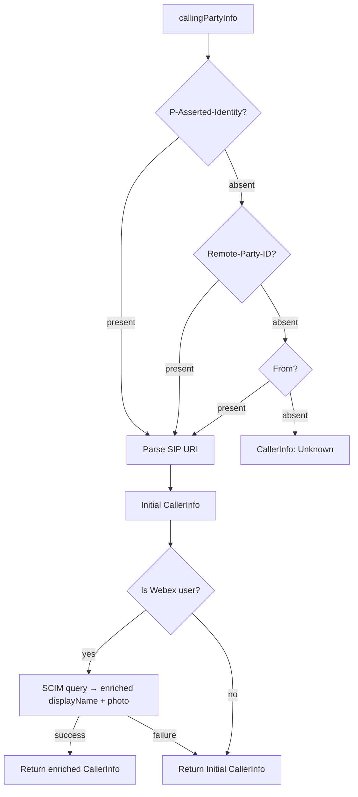
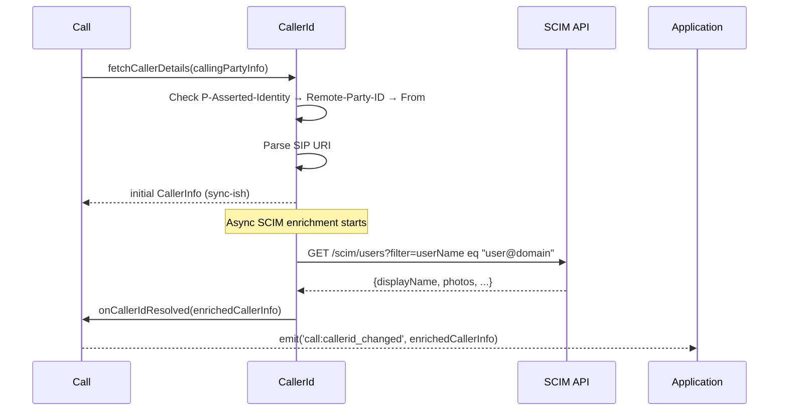
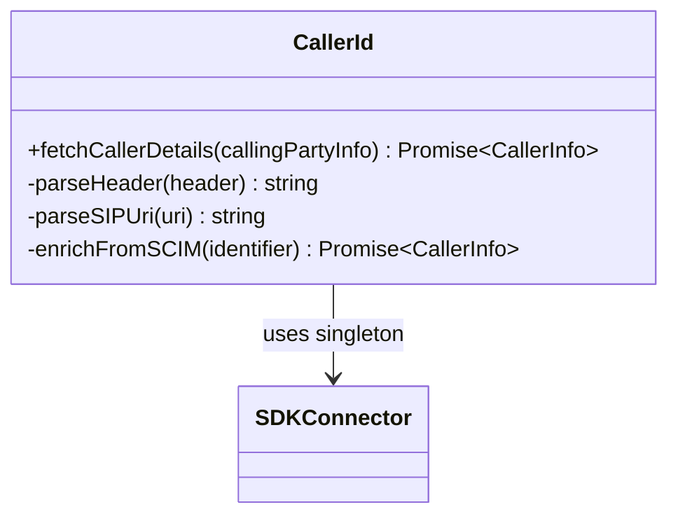

<!-- ───────────────────────────────
  Template:     Module Spec
  Template-ID:  module-spec
  Generates:    packages/calling/src/CallingClient/calling/CallerId/ai-docs/caller-id-spec.md
  Description:  Canonical spec for the CallerId sub-module.
  Library ver:  0.2.0
  Last updated: 2026-07-03
─────────────────────────────── -->

# CallerId — SPEC

> Start here → root [`AGENTS.md`](../../../../../AGENTS.md) (agent entry) · router [`SPEC_INDEX.md`](../../../../ai-docs/SPEC_INDEX.md) · parent [`calling-sub-spec.md`](../../ai-docs/calling-sub-spec.md). This is the CallerId canonical spec.

## Metadata

| Field | Value |
|---|---|
| Module id | `CallerId` |
| Source path(s) | `packages/calling/src/CallingClient/calling/CallerId/` |
| Doc kind | Module spec |
| Coverage score | Specced |
| Generated from | `module-spec` @ SDLC template library `0.2.0` |
| generated_by / approved_by / updated_at | migrated from `CallerId/ai-docs/AGENTS.md` / pending / 2026-07-03 |
| Validation status | not-run |

## Evidence Rules

Every requirement cites `file path`. Test evidence preferred for WHY.

## Source Material Register

| Source doc | Scope | Decision | Detail location or disposition |
|---|---|---|---|
| `CallerId/ai-docs/AGENTS.md` | overview, resolution rules, header priority, SCIM enrichment, control flow, agent rules | migrated | All sections below |

## Overview

`CallerId` resolves caller identity for incoming calls through a deterministic, multi-source enrichment pipeline:

1. **SIP header priority** — reads `P-Asserted-Identity` → `Remote-Party-ID` → `From` (in order); first match wins.
2. **SIP URI parsing** — extracts `userpart@domain` from the matched header.
3. **Async SCIM enrichment** — if the resolved identity is a Webex user, queries SCIM to add display name and photo.
4. **Incremental event update** — the `call:callerid_changed` event fires after SCIM resolves, providing an updated `CallerInfo`.

`CallerId` is stateless and functional — it is called once per incoming call.

**Usage:** `callerId.fetchCallerDetails(callingPartyInfo) → Promise<CallerInfo>` (called internally by `Call`)

## Purpose / Responsibility

Owns caller identity resolution for incoming calls only. Does NOT own call state, media, or outbound call participant display.

## Stack

TypeScript, Jest/jsdom. No additional runtime deps.

## Folder / Package Structure

```
CallerId/
├── CallerId.ts             # Resolution logic
├── CallerId.test.ts        # Unit tests
├── types.ts                # ICallerId, CallerInfo, SIPHeaders
└── ai-docs/
    ├── caller-id-spec.md   # This file (canonical spec)
    └── AGENTS.md           # Original agent doc
```

## Key Files (source of truth)

| File | Holds |
|---|---|
| `types.ts` | `ICallerId`, `CallerInfo`, SIP header field names |
| `CallerId.ts` | Header priority logic, SIP URI parser, SCIM query integration |

## Public Surface

| Contract ID | Type | Surface | Purpose | Compatibility | Schema | Root index |
|---|---|---|---|---|---|---|
| `CallerId.fetchCallerDetails` | SDK-internal | `(callingPartyInfo: CallingPartyInfo): Promise<CallerInfo>` | Resolve caller identity from SIP headers + SCIM | stable | `CallerId/types.ts#ICallerId` | `SPEC_INDEX.md` |

## Requires (dependencies)

- **Internal**: `SDKConnector` (singleton), `Logger`
- **External**: SCIM API (for Webex user enrichment)

## Requirements

| ID | WHAT | WHY | Source Evidence | Test / Example Evidence | Assumptions / Gaps | Confidence |
|---|---|---|---|---|---|---|
| `CID-R-001` | Header resolution MUST follow strict priority: `P-Asserted-Identity` → `Remote-Party-ID` → `From`; first non-empty header wins | `P-Asserted-Identity` is the most authoritative; `From` is the fallback | `CallerId.ts` (header priority logic) | `CallerId.test.ts` | none | PRESENT |
| `CID-R-002` | SIP URI parsing MUST extract `userpart@domain` as the canonical identifier | Consistent identity format is required for SCIM correlation | `CallerId.ts` (SIP URI parser) | `CallerId.test.ts` — URI parsing tests | none | PRESENT |
| `CID-R-003` | SCIM enrichment MUST be attempted asynchronously after initial ID resolution; MUST fire `call:callerid_changed` when enrichment completes | SCIM latency should not block `line:incoming_call`; enriched data fires as an update | `CallerId.ts` (async SCIM path) | `CallerId.test.ts` — async enrichment tests | none | PRESENT |
| `CID-R-004` | SCIM enrichment failure MUST be non-fatal — `fetchCallerDetails()` MUST resolve with the un-enriched `CallerInfo` on SCIM error | Caller identity display must work even if SCIM is unavailable | `CallerId.ts` (SCIM error catch) | `CallerId.test.ts` — SCIM failure test | none | PRESENT |
| `CID-R-005` | If all three SIP headers are absent or empty, `fetchCallerDetails()` MUST return a `CallerInfo` with `displayName: 'Unknown'` | Calls from restricted-ID sources have no headers; app must show a fallback | `CallerId.ts` (fallback to Unknown) | `CallerId.test.ts` | none | PRESENT |

## Design Overview

`CallerId` is a pure resolution function: no state, no event bus ownership. `Call` calls `callerId.fetchCallerDetails(callingPartyInfo)` synchronously at construction — the method starts SCIM enrichment in a background promise and immediately returns the initial `CallerInfo`. When SCIM resolves, `Call` emits `call:callerid_changed` to notify the application.

## Control Flow



## Sequence Diagram(s)



## Class / Component Relationships



## Use Cases

- **UC-1 Standard incoming call:** `P-Asserted-Identity` present → parsed → SCIM → enriched name + photo. Evidence: `CallerId.ts`, `CallerId.test.ts`.
- **UC-2 Restricted-ID call:** All headers absent → `CallerInfo.displayName = 'Unknown'`. Evidence: `CallerId.ts`.
- **UC-3 SCIM unavailable:** SCIM returns 5xx → non-fatal catch → return initial `CallerInfo` without enrichment. Evidence: `CallerId.ts`.
- **UC-4 External PSTN call:** `From` header only (SIP trunk) → SCIM enrichment attempted but likely returns no match → initial CallerInfo returned. Evidence: `CallerId.ts`.

## Business Rules & Invariants

- Header priority is fixed and immutable: `P-Asserted-Identity` always wins over `Remote-Party-ID`, which always wins over `From`.
- SCIM enrichment runs asynchronously and independently — it NEVER blocks the `line:incoming_call` delivery.
- The `call:callerid_changed` event may fire 0 or 1 times per call (0 if SCIM fails or call is external; 1 if enrichment succeeds).

## Error Handling & Failure Modes

| Condition | Signal | Caller recovery |
|---|---|---|
| All SIP headers absent | `CallerInfo.displayName = 'Unknown'` | Display fallback UI |
| SCIM enrichment fails | Initial un-enriched `CallerInfo` returned; no throw | Display basic caller ID |
| SIP URI unparseable | Falls back to raw header value | Display header value as-is |

## Pitfalls

- `call:callerid_changed` fires AFTER `line:incoming_call` — display caller ID from the incoming_call event first, then update when `callerid_changed` arrives.
- If `P-Asserted-Identity` is present but malformed, the parser falls through to `Remote-Party-ID` only if `P-Asserted-Identity` is empty/absent — a malformed non-empty value is used as-is.
- SCIM is queried for ALL resolved identifiers, including PSTN numbers — the result will simply be empty for non-Webex callers.

## Test-Case Strategy (module)

Unit tests in `CallerId.test.ts`. Key coverage: header priority all three positions, SIP URI parsing, SCIM enrichment happy path, SCIM failure fallback, all-absent headers.

| Behavior / Requirement | Existing test evidence | Gap |
|---|---|---|
| `CID-R-001` Header priority | `CallerId.test.ts` | none |
| `CID-R-002` SIP URI parsing | `CallerId.test.ts` | none |
| `CID-R-003` Async SCIM + event | `CallerId.test.ts` | none |
| `CID-R-004` SCIM failure non-fatal | `CallerId.test.ts` | none |
| `CID-R-005` Unknown fallback | `CallerId.test.ts` | none |

## Traceability

- Parent spec: `../../ai-docs/calling-sub-spec.md` · Registry: `../../../../ai-docs/SPEC_INDEX.md`
- Coverage state: `.sdd/manifest.json` (pending)
