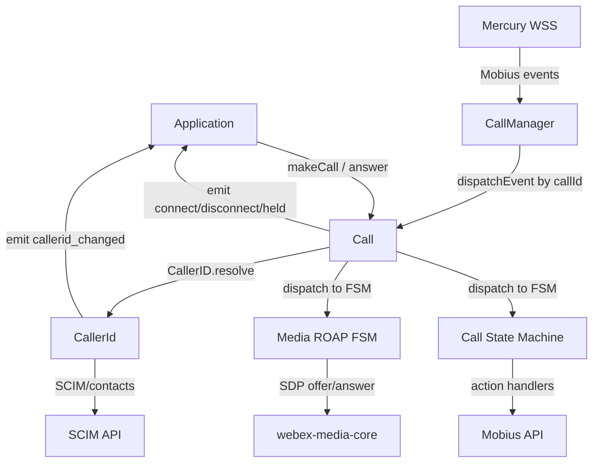
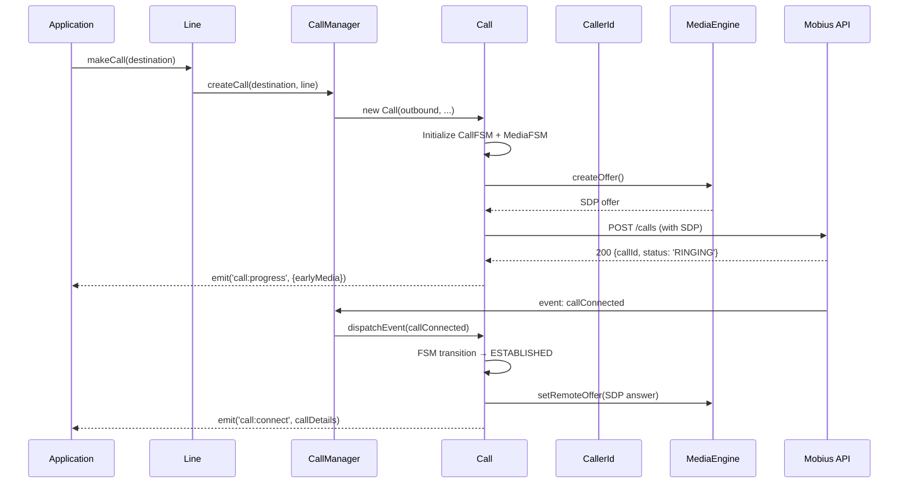
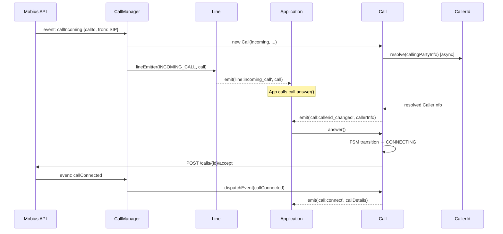
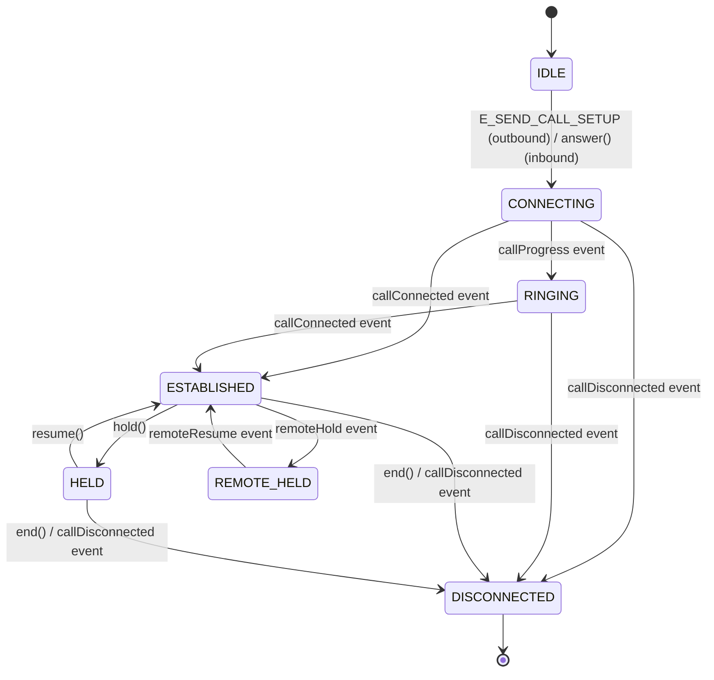
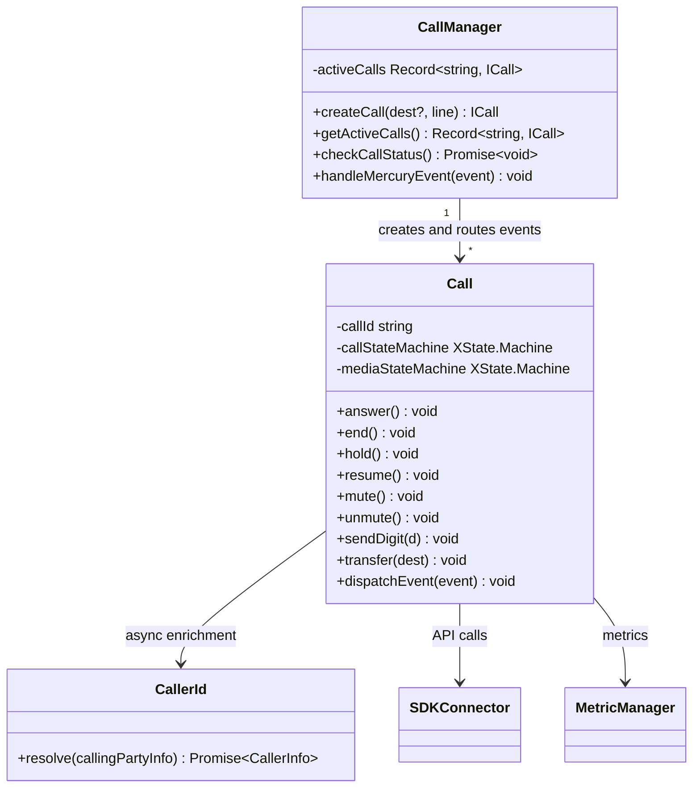

<!-- ───────────────────────────────
  Template:     Module Spec
  Template-ID:  module-spec
  Generates:    packages/calling/src/CallingClient/calling/ai-docs/calling-sub-spec.md
  Description:  Canonical spec for the calling sub-module (Call, CallManager, CallerId, state machines).
  Library ver:  0.2.0
  Last updated: 2026-07-03
─────────────────────────────── -->

# Calling Sub-Module — SPEC

> Start here → root [`AGENTS.md`](../../../../AGENTS.md) (agent entry) · router [`SPEC_INDEX.md`](../../../ai-docs/SPEC_INDEX.md) · parent [`calling-client-spec.md`](../../ai-docs/calling-client-spec.md). This is the calling sub-module canonical spec.

## Metadata

| Field | Value |
|---|---|
| Module id | `CallingClient/calling` |
| Source path(s) | `packages/calling/src/CallingClient/calling/` |
| Doc kind | Module spec |
| Coverage score | Specced |
| Generated from | `module-spec` @ SDLC template library `0.2.0` |
| generated_by / approved_by / updated_at | migrated from `calling/ai-docs/ARCHITECTURE.md` / pending / 2026-07-03 |
| Validation status | not-run |

## Evidence Rules

Every requirement cites `file path`. Test evidence preferred for WHY.

## Source Material Register

| Source doc | Scope | Decision | Detail location or disposition |
|---|---|---|---|
| `calling/ai-docs/ARCHITECTURE.md` | components, class diagram, state machines, call flows, SDP, API endpoints | migrated | Design Overview, State Machine, Data Flow, Sequence Diagrams |

## Overview

The calling sub-module contains four closely coupled components: `CallManager` (routes Mobius SIP events to `Call` objects), `Call` (call lifecycle FSM, SDP negotiation, ROAP media), `CallerId` (resolves caller identity for incoming calls), and the XState-based **Call State Machine** + **Media ROAP State Machine**.

`CallManager` is the singleton entry point: it creates `Call` instances and dispatches Mobius events. Each `Call` drives two concurrent XState FSMs — the **call state machine** (call progress: idle → connecting → established → held → disconnected) and the **media ROAP state machine** (SDP offer/answer exchange). A third component `CallerId` enriches `Call` objects with resolved caller display names.

## Purpose / Responsibility

Owns: SIP event routing (CallManager), call state machine and media negotiation (Call), and caller identity resolution (CallerId). Does NOT own registration (delegated to `Registration`), line management (delegated to `Line`), or metrics (delegated to `MetricManager`).

## Stack

TypeScript, `xstate` (FSMs), `@webex/internal-media-core` (media engine), Jest/jsdom, `sinon`.

## Folder / Package Structure

```
calling/
├── call.ts                     # Call class — FSM driver, SDP, event emission
├── call.test.ts                # Unit tests for Call
├── callManager.ts              # CallManager singleton — call creation, event routing
├── callManager.test.ts         # Unit tests for CallManager
├── callStateMachine.ts         # XState call FSM definition
├── callStateMachine.test.ts    # Call FSM unit tests
├── mediaStateMachine.ts        # XState ROAP media FSM definition
├── types.ts                    # ICall, CallDetails, call event types
├── constants.ts                # API endpoints, state names, action names
├── CallerId/                   # CallerId sub-module
│   ├── CallerId.ts
│   ├── CallerId.test.ts
│   └── ai-docs/
│       └── caller-id-spec.md
└── ai-docs/
    ├── calling-sub-spec.md     # This file (canonical spec)
    └── ARCHITECTURE.md         # Original architecture doc
```

## Key Files (source of truth)

| File | Holds |
|---|---|
| `call.ts` | `Call` class — authoritative source for call lifecycle and event emission |
| `callManager.ts` | `CallManager` singleton — `createCall()`, `getActiveCalls()`, `checkCallStatus()` |
| `callStateMachine.ts` | XState FSM: all states, transitions, action handlers |
| `mediaStateMachine.ts` | XState ROAP FSM: SDP offer/answer exchange states |
| `types.ts` | `ICall`, `CallDetails`, `CALL_EVENT_KEYS`, `CallEndCause` |
| `constants.ts` | API endpoint constants, state names |

## Public Surface

`CallManager` (singleton accessed via `getCallManager()`):

| Contract ID | Type | Surface | Purpose | Compatibility | Schema | Root index |
|---|---|---|---|---|---|---|
| `CallManager.createCall` | SDK-internal | `(dest?, line) → ICall` | Create outbound call | stable | `calling/types.ts#ICall` | `SPEC_INDEX.md` |
| `CallManager.getActiveCalls` | SDK-internal | `(): Record<string, ICall>` | All active calls by callId | stable | `calling/types.ts` | `SPEC_INDEX.md` |
| `CallManager.checkCallStatus` | SDK-internal | `(): Promise<void>` | Verify active calls with Mobius post-reconnect | stable | `calling/types.ts` | `SPEC_INDEX.md` |

`Call` (returned by `createCall` / incoming call events):

| Contract ID | Type | Surface | Purpose | Compatibility | Schema | Root index |
|---|---|---|---|---|---|---|
| `Call.answer` | SDK | `(): void` | Answer incoming call | stable | `calling/types.ts#ICall` | `SPEC_INDEX.md` |
| `Call.end` | SDK | `(): void` | End the call | stable | `calling/types.ts#ICall` | `SPEC_INDEX.md` |
| `Call.hold` | SDK | `(): void` | Put call on hold | stable | `calling/types.ts#ICall` | `SPEC_INDEX.md` |
| `Call.resume` | SDK | `(): void` | Resume held call | stable | `calling/types.ts#ICall` | `SPEC_INDEX.md` |
| `Call.mute` | SDK | `(): void` | Mute audio | stable | `calling/types.ts#ICall` | `SPEC_INDEX.md` |
| `Call.unmute` | SDK | `(): void` | Unmute audio | stable | `calling/types.ts#ICall` | `SPEC_INDEX.md` |
| `Call.sendDigit` | SDK | `(digit: string): void` | Send DTMF digit | stable | `calling/types.ts#ICall` | `SPEC_INDEX.md` |
| `Call.transfer` | SDK | `(destination: string): void` | Blind transfer | stable | `calling/types.ts#ICall` | `SPEC_INDEX.md` |
| `Call.doHoldResume` | SDK | `(): void` | Toggle hold/resume | stable | `calling/types.ts#ICall` | `SPEC_INDEX.md` |

Events emitted by `Call`:

| Event | Payload | Description |
|---|---|---|
| `call:connect` | `CallDetails` | Call answered / established |
| `call:disconnect` | `{code, reason, callEndCause}` | Call ended |
| `call:held` | _(none)_ | Call put on hold |
| `call:resumed` | _(none)_ | Call resumed from hold |
| `call:remote_held` | _(none)_ | Remote party held |
| `call:remote_resumed` | _(none)_ | Remote party resumed |
| `call:callerid_changed` | `CallerInfo` | CallerID resolved asynchronously |
| `call:progress` | `{earlyMedia: boolean}` | Ringing / early media |

## Requires (dependencies)

- **Internal**: `SDKConnector` (singleton), `MetricManager`, `CallingClient` (media engine), `CallerID`
- **External**: Mobius WSS events (via Mercury), `@webex/internal-media-core` (media), XState

## Requirements

| ID | WHAT | WHY | Source Evidence | Test / Example Evidence | Assumptions / Gaps | Confidence |
|---|---|---|---|---|---|---|
| `CS2-R-001` | `CallManager` MUST be a singleton — `getCallManager()` returns the same instance | All Mobius WSS events must route through one coordinator to match events to Call objects | `callManager.ts` (singleton pattern) | `callManager.test.ts` | none | PRESENT |
| `CS2-R-002` | `CallManager` MUST route all incoming Mobius events by `callId` to the correct `Call` object via `dispatchEvent()` | Each Mobius event is call-scoped; routing must be exact | `callManager.ts` | `callManager.test.ts` | none | PRESENT |
| `CS2-R-003` | Each `Call` MUST drive two concurrent XState FSMs: call state machine + media ROAP state machine | Separating call state from media negotiation state avoids entangled conditional logic | `call.ts` (FSM initialization) | `call.test.ts`, `callStateMachine.test.ts` | none | PRESENT |
| `CS2-R-004` | Incoming call construction MUST follow: Mobius INVITE → `CallManager.createCall()` → `CallerId.resolve()` (async) → `LINE_EVENTS.INCOMING_CALL` with pre-resolved ID | Caller ID must start resolving before the app sees the call; async enrichment fires `call:callerid_changed` | `call.ts` (incoming construction pipeline) | `call.test.ts` | none | PRESENT |
| `CS2-R-005` | `Call.hold()` MUST send a Mobius `callHold` request AND transition the local call state machine; `resume()` MUST send `callResume` AND update FSM | Hold/resume requires both server-side update and local state tracking | `call.ts` | `call.test.ts` | none | PRESENT |
| `CS2-R-006` | SDP offer creation MUST use `@webex/internal-media-core`; `call.ts` MUST NOT generate SDP manually | Media engine handles codec negotiation; manual SDP would diverge | `call.ts` (SDP methods) | `call.test.ts` | none | PRESENT |
| `CS2-R-007` | Call keepalive MUST send `POST /calls/{id}/status` at the interval returned by Mobius; MUST stop on call end | Mobius drops calls without keepalive acknowledgement | `call.ts` (keepalive timer) | `call.test.ts` | none | PRESENT |
| `CS2-R-008` | `checkCallStatus()` MUST POST to Mobius for each active call after Mercury reconnect; calls not acknowledged by Mobius MUST be ended via `E_SEND_CALL_DISCONNECT` | Mobius may have dropped calls during disconnection; stale local state must be cleared | `callManager.ts` (checkCallStatus) | `callManager.test.ts` | none | PRESENT |

## Design Overview

Event routing: Mobius sends all SIP/call events via Mercury WebSocket. `CallManager` receives these in the `handleMercuryEvent()` pipeline, looks up the `Call` by `callId`, and calls `Call.dispatchEvent(event)`. The call's XState FSM interprets the event and drives side effects (Mobius API calls, media engine, event emission to app).

Two FSMs per call: **Call FSM** owns progress states (idle → connecting → established → held → disconnected) and action dispatch. **Media ROAP FSM** owns SDP offer/answer exchange (idle → offer-sent → offer-received → established). Both FSMs are created in `Call.constructor()` and run concurrently.

## Data Flow



## Sequence Diagram(s)

Sequence coverage:

| Operation group | Diagram | Failure / recovery coverage |
|---|---|---|
| Outgoing call flow | Outgoing sequence | Media failure path |
| Incoming call flow | Incoming sequence | CallerId async enrichment |
| Hold/resume | Hold sequence | Server fail → revert |
| Call disconnect | Disconnect sequence | Mobius-initiated disconnect |





## State Machine



## Class / Component Relationships



## Use Cases

- **UC-1 Make outbound call:** `line.makeCall('+1-555-0100')` → SDP offer → Mobius POST → `call:progress` → `call:connect`. Evidence: `call.ts`, `callManager.ts`.
- **UC-2 Receive incoming call:** `line:incoming_call` event → `call.answer()` → Mobius accept → `call:connect`. Evidence: `call.ts`.
- **UC-3 Hold/resume:** `call.hold()` → Mobius callHold + FSM → `call:held`. `call.resume()` → Mobius callResume + FSM → `call:resumed`. Evidence: `call.ts`.
- **UC-4 Transfer call:** `call.transfer(destination)` → Mobius blind transfer. Evidence: `call.ts`.
- **UC-5 Post-reconnect call check:** Mercury reconnects → `checkCallStatus()` → Mobius confirms active calls or triggers `E_SEND_CALL_DISCONNECT`. Evidence: `callManager.ts`.

## Business Rules & Invariants

- `CallManager` is a singleton — never instantiate directly.
- Each `Call` has EXACTLY two FSMs — call state and media ROAP — both initialized in the constructor.
- `CallerId.resolve()` starts asynchronously at call construction for incoming calls — the `call:callerid_changed` event fires AFTER `line:incoming_call`.
- `checkCallStatus()` terminates calls locally if Mobius does not acknowledge them — preventing ghost calls.

## Concurrency & Reactive Flow

- Mobius events arrive via Mercury WebSocket callbacks (single-threaded JS event loop).
- `CallManager.dispatchEvent()` is synchronous — events are processed in order.
- `CallerID.resolve()` is async — it fires `call:callerid_changed` independently from the call setup flow.
- XState FSMs are synchronous — all transitions execute in a single microtask.

## Error Handling & Failure Modes

| Condition | Signal | Caller recovery |
|---|---|---|
| Mobius rejects `POST /calls` | `call:disconnect` with error code | App shows call-failed UI |
| SDP negotiation failure | `call:disconnect` with media error | Retry or check media device |
| `checkCallStatus` — call not acknowledged | `E_SEND_CALL_DISCONNECT` → `call:disconnect` | App cleans up UI |
| Incoming call while max calls active | `callManager` rejects; app receives no event | Check active call count before accepting |

## Pitfalls

- `call:callerid_changed` fires AFTER `line:incoming_call` — apps must handle incremental caller ID update.
- `Call.hold()` both calls Mobius AND transitions the FSM — calling one without the other creates state desync.
- `checkCallStatus()` sends a POST per active call — on a heavily loaded client this can spike traffic on reconnect.
- XState FSM states are defined by string names in `callStateMachine.ts` — typos silently fail transitions.

## Test-Case Strategy (module)

Unit tests in `call.test.ts`, `callManager.test.ts`, `callStateMachine.test.ts`. Uses `sinon` stubs for Mercury and Mobius. Key coverage: FSM transitions, outbound/inbound flows, hold/resume, SDP, checkCallStatus, CallerId async enrichment.

| Behavior / Requirement | Existing test evidence | Gap |
|---|---|---|
| `CS2-R-001` CallManager singleton | `callManager.test.ts` | none |
| `CS2-R-002` Event routing by callId | `callManager.test.ts` | none |
| `CS2-R-003` Two FSMs per call | `call.test.ts`, `callStateMachine.test.ts` | none |
| `CS2-R-004` Incoming call pipeline + async CallerID | `call.test.ts` | none |
| `CS2-R-005` hold/resume server + FSM | `call.test.ts` | none |
| `CS2-R-006` SDP via media engine | `call.test.ts` | none |
| `CS2-R-007` Call keepalive | `call.test.ts` | none |
| `CS2-R-008` checkCallStatus | `callManager.test.ts` | none |

## Traceability

- Parent spec: `../../ai-docs/calling-client-spec.md` · Registry: `../../../ai-docs/SPEC_INDEX.md`
- Sub-module spec: `CallerId/ai-docs/caller-id-spec.md`
- Sibling specs: `../line/ai-docs/line-spec.md`, `../registration/ai-docs/registration-spec.md`
- Coverage state: `.sdd/manifest.json` (pending)
