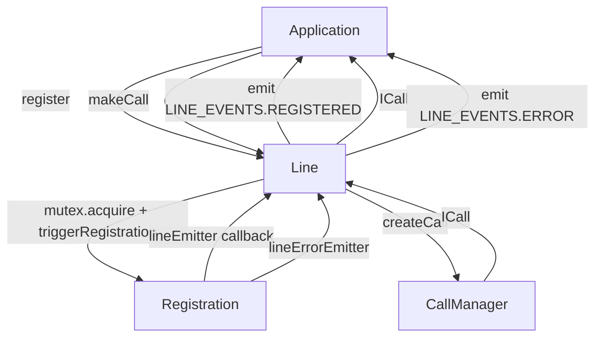
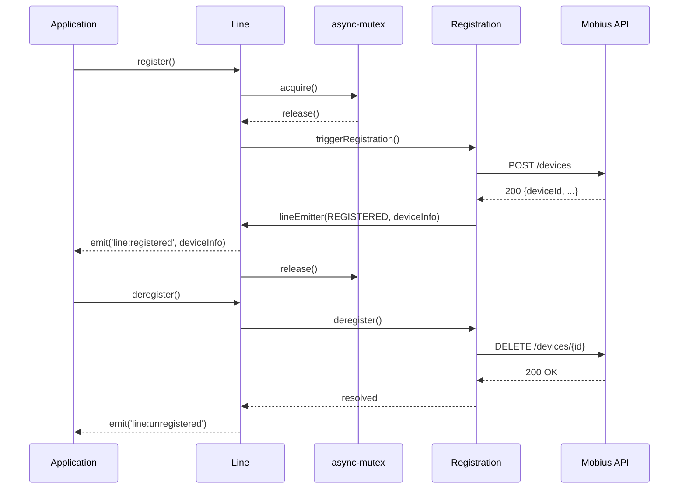
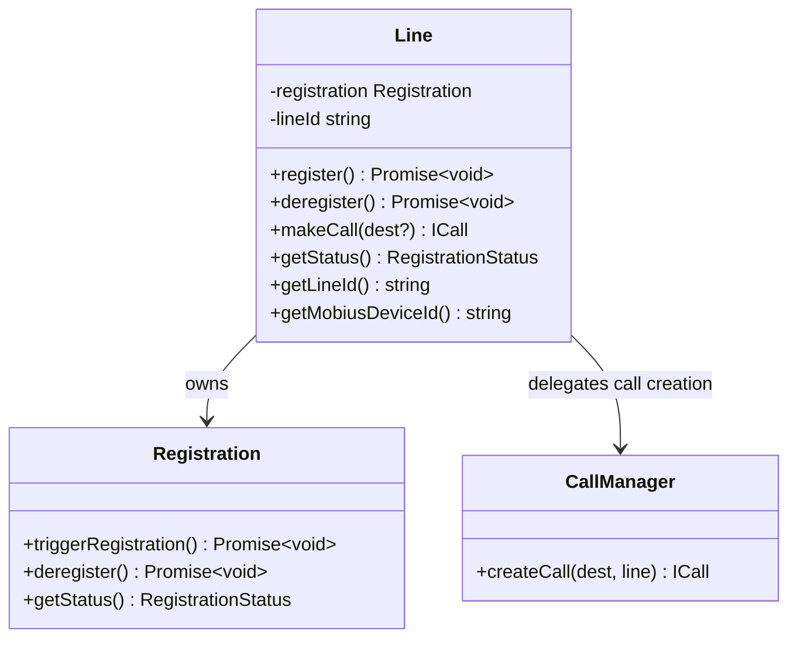

<!-- ───────────────────────────────
  Template:     Module Spec
  Template-ID:  module-spec
  Generates:    packages/calling/src/CallingClient/line/ai-docs/line-spec.md
  Description:  Canonical spec for the Line sub-module.
  Library ver:  0.2.0
  Last updated: 2026-07-03
─────────────────────────────── -->

# Line — SPEC

> Start here → root [`AGENTS.md`](../../../../AGENTS.md) (agent entry) · router [`SPEC_INDEX.md`](../../../ai-docs/SPEC_INDEX.md) · parent [`calling-client-spec.md`](../../ai-docs/calling-client-spec.md). This is the Line canonical spec.

## Metadata

| Field | Value |
|---|---|
| Module id | `Line` |
| Source path(s) | `packages/calling/src/CallingClient/line/` |
| Doc kind | Module spec |
| Coverage score | Specced |
| Generated from | `module-spec` @ SDLC template library `0.2.0` |
| generated_by / approved_by / updated_at | migrated from `line/ai-docs/AGENTS.md` / pending / 2026-07-03 |
| Validation status | not-run |

## Evidence Rules

Every requirement cites `file path`. Test evidence preferred for WHY.

## Source Material Register

| Source doc | Scope | Decision | Detail location or disposition |
|---|---|---|---|
| `line/ai-docs/AGENTS.md` | overview, public API, events, error types, examples | migrated | All sections below |

## Overview

`Line` bridges `CallingClient` with `Registration` and `CallManager`. It provides a stable `ILine` interface to the application for registration lifecycle management and outbound call initiation. Each `Line` instance corresponds to one device registration (one SIP URI / directory number) on Mobius.

`Line` receives `lineEmitter` callbacks from `Registration` and bridges them to typed events (`LINE_EVENTS`) that the application observes. It also delegates `makeCall()` to `CallManager`.

**Factory (internal):** `createLine(userId, deviceUri, mutex, mobiusUris, ...) → ILine` (called by `CallingClient.init()` only)

## Purpose / Responsibility

Owns the registration lifecycle API (register/deregister) and call initiation on behalf of a single device. Does NOT own the registration protocol (delegated to `Registration`) or call signaling (delegated to `CallManager`).

## Stack

TypeScript, Jest/jsdom. `async-mutex` for registration serialization.

## Folder / Package Structure

```
line/
├── line.ts                     # Line class, ILine implementation
├── line.test.ts                # Unit tests
├── types.ts                    # ILine, LineError, LINE_EVENTS, LineEmitterCallback
├── constants.ts                # Line-specific constants
└── ai-docs/
    ├── line-spec.md            # This file (canonical spec)
    └── AGENTS.md               # Original agent doc
```

## Key Files (source of truth)

| File | Holds |
|---|---|
| `types.ts` | `ILine`, `LineError`, `LINE_EVENTS`, `LineEmitterCallback`, `LineErrorEmitterCallback` |

## Public Surface

| Contract ID | Type | Surface | Purpose | Compatibility | Schema | Root index |
|---|---|---|---|---|---|---|
| `Line.register` | SDK | `(): Promise<void>` | Start registration with Mobius | stable | `line/types.ts#ILine` | `SPEC_INDEX.md` |
| `Line.deregister` | SDK | `(): Promise<void>` | Deregister from Mobius | stable | `line/types.ts#ILine` | `SPEC_INDEX.md` |
| `Line.makeCall` | SDK | `(destination?: string): ICall` | Create an outbound call | stable | `line/types.ts#ILine` | `SPEC_INDEX.md` |
| `Line.getStatus` | SDK | `(): RegistrationStatus` | Current registration status | stable | `line/types.ts#ILine` | `SPEC_INDEX.md` |
| `Line.getLineId` | SDK | `(): string` | Returns the line's UUID | stable | `line/types.ts#ILine` | `SPEC_INDEX.md` |
| `Line.getMobiusDeviceId` | SDK | `(): string \| undefined` | Device ID assigned by Mobius after registration | stable | `line/types.ts#ILine` | `SPEC_INDEX.md` |

Events emitted:

| Event | Enum Key | Payload | Description |
|---|---|---|---|
| `line:registered` | `LINE_EVENTS.REGISTERED` | `DeviceInfo` | Registration succeeded |
| `line:unregistered` | `LINE_EVENTS.UNREGISTERED` | _(none)_ | Deregistration succeeded |
| `line:error` | `LINE_EVENTS.ERROR` | `LineError` | Registration or operation error |
| `line:reconnecting` | `LINE_EVENTS.RECONNECTING` | _(none)_ | Reconnection in progress |
| `line:incoming_call` | `LINE_EVENTS.INCOMING_CALL` | `ICall` | Incoming call received |

## Requires (dependencies)

- **Internal**: `Registration` (owns the protocol), `CallManager` (owns call creation), `async-mutex`
- **External (indirect)**: Mobius API via `Registration`

## Requirements

| ID | WHAT | WHY | Source Evidence | Test / Example Evidence | Assumptions / Gaps | Confidence |
|---|---|---|---|---|---|---|
| `LN-R-001` | `Line.register()` MUST acquire the `async-mutex` before delegating to `Registration.triggerRegistration()` | Prevents concurrent duplicate registrations from the same `Line` instance | `line.ts` (mutex.acquire in register) | `line.test.ts` | none | PRESENT |
| `LN-R-002` | `Line` MUST emit `LINE_EVENTS.REGISTERED` with `DeviceInfo` when `Registration` calls back with success | Application needs device info to correlate calls and metrics | `line.ts` (lineEmitter callback mapping) | `line.test.ts` | none | PRESENT |
| `LN-R-003` | `Line` MUST emit `LINE_EVENTS.ERROR` with a `LineError` when `Registration` reports a registration failure | Error details include error code and message for application handling | `line.ts` (lineEmitter error path) | `line.test.ts` | none | PRESENT |
| `LN-R-004` | `Line.makeCall()` MUST delegate to `CallManager.createCall(destination, line)` and return the resulting `ICall` | `CallManager` owns all call lifecycle; `Line` just bridges | `line.ts` | `line.test.ts` | none | PRESENT |
| `LN-R-005` | `Line.deregister()` MUST call `Registration.deregister()` and then emit `LINE_EVENTS.UNREGISTERED` | Application must observe deregistration completion | `line.ts` | `line.test.ts` | none | PRESENT |
| `LN-R-006` | `LineError.code` MUST be populated from the `ERROR_CODE` enum — not raw HTTP status codes | Callers distinguish error types by `code`, not HTTP semantics | `line/types.ts#LineError` | `line.test.ts` | none | PRESENT |

## Design Overview

`Line` is a thin coordination layer. It holds a `Registration` instance and emits `LINE_EVENTS` events by translating `lineEmitter` callbacks from `Registration`. `makeCall()` is delegated directly to `CallManager`. `getStatus()` reads `Registration.getStatus()` without caching.

## Data Flow



## Sequence Diagram(s)



## Class / Component Relationships



## Use Cases

- **UC-1 Register:** `line.register()` → wait for `line:registered` event. Evidence: `line.ts`, `line.test.ts`.
- **UC-2 Make outbound call:** `line.makeCall('+1-555-0100')` → receives `ICall`. Evidence: `line.ts`.
- **UC-3 Handle incoming call:** Listen for `line:incoming_call` event → `ICall` in payload. Evidence: `line.ts`.
- **UC-4 Deregister:** `line.deregister()` → wait for `line:unregistered` event. Evidence: `line.ts`.

## Error Handling & Failure Modes

| Condition | Signal | Caller recovery |
|---|---|---|
| Registration 401/403 | `LINE_EVENTS.ERROR` with `LineError{code: AUTH_ERROR}` | Fatal — check user entitlements |
| Registration 429 | `LINE_EVENTS.ERROR` with `LineError{code: RATE_LIMITED}` | Retry after delay |
| Mobius server unreachable | `LINE_EVENTS.ERROR` with network error code | Check connectivity |
| `makeCall` before registered | `CallManager` returns error | Call `register()` first |

## Pitfalls

- `line.register()` is asynchronous but the resolved promise does NOT guarantee registration success — wait for the `line:registered` event.
- `getStatus()` reflects `Registration.getStatus()` — it can be `IDLE` immediately after `createClient()` even though `init()` has run.
- `makeCall()` delegates to `CallManager` — passing an empty destination creates an open call ready for the user to enter digits.

## Test-Case Strategy (module)

Unit tests in `line.test.ts`. Uses mocked `Registration` and `CallManager`. Key coverage: register/deregister flows, event emission, error propagation, mutex behavior.

| Behavior / Requirement | Existing test evidence | Gap |
|---|---|---|
| `LN-R-001` Mutex on register | `line.test.ts` | none |
| `LN-R-002` REGISTERED event | `line.test.ts` | none |
| `LN-R-003` ERROR event | `line.test.ts` | none |
| `LN-R-004` makeCall delegation | `line.test.ts` | none |
| `LN-R-005` UNREGISTERED event | `line.test.ts` | none |
| `LN-R-006` LineError.code from enum | `line.test.ts` | none |

## Traceability

- Parent spec: `../../ai-docs/calling-client-spec.md` · Registry: `../../../ai-docs/SPEC_INDEX.md`
- Sibling specs: `../registration/ai-docs/registration-spec.md`, `../calling/ai-docs/calling-sub-spec.md`
- Coverage state: `.sdd/manifest.json` (pending)
