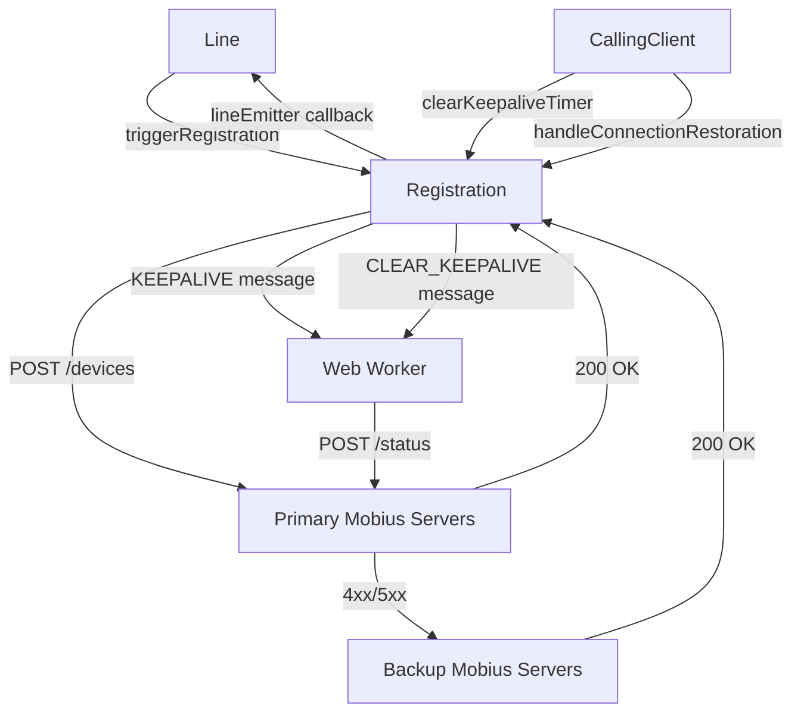
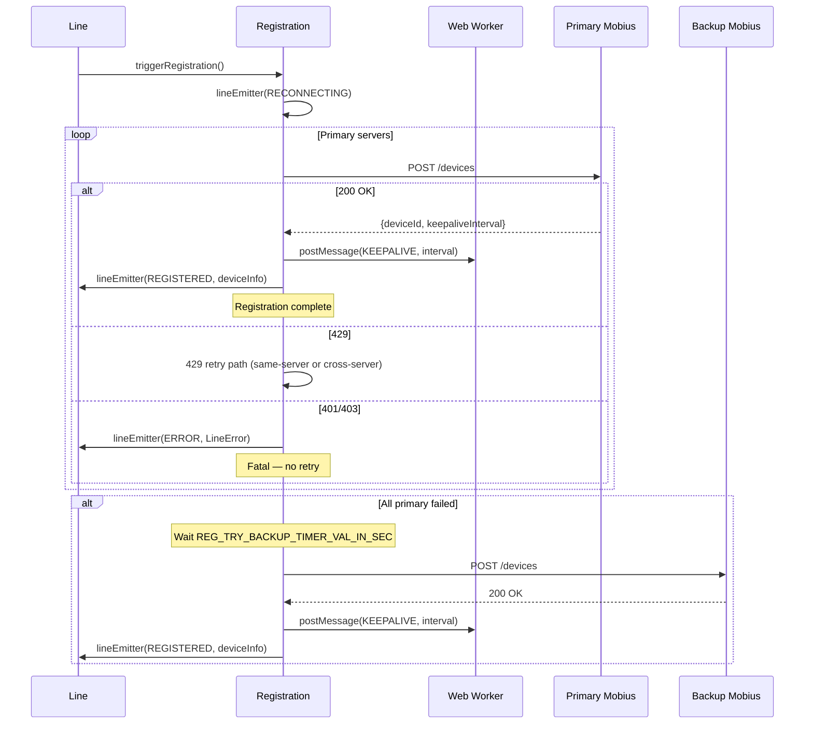
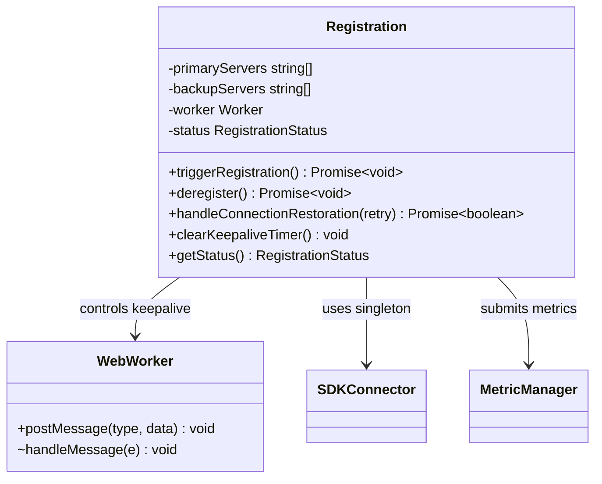

<!-- ───────────────────────────────
  Template:     Module Spec
  Template-ID:  module-spec
  Generates:    packages/calling/src/CallingClient/registration/ai-docs/registration-spec.md
  Description:  Canonical spec for the Registration sub-module.
  Library ver:  0.2.0
  Last updated: 2026-07-03
─────────────────────────────── -->

# Registration — SPEC

> Start here → root [`AGENTS.md`](../../../../AGENTS.md) (agent entry) · router [`SPEC_INDEX.md`](../../../ai-docs/SPEC_INDEX.md) · parent [`calling-client-spec.md`](../../ai-docs/calling-client-spec.md). This is the Registration canonical spec.

## Metadata

| Field | Value |
|---|---|
| Module id | `Registration` |
| Source path(s) | `packages/calling/src/CallingClient/registration/` |
| Doc kind | Module spec |
| Coverage score | Specced |
| Generated from | `module-spec` @ SDLC template library `0.2.0` |
| generated_by / approved_by / updated_at | migrated from `registration/ai-docs/AGENTS.md` / pending / 2026-07-03 |
| Validation status | not-run |

## Evidence Rules

Every requirement cites `file path`. Test evidence preferred for WHY.

## Source Material Register

| Source doc | Scope | Decision | Detail location or disposition |
|---|---|---|---|
| `registration/ai-docs/AGENTS.md` | overview, public API, registration flow, keepalive, 429 retry paths, server selection, examples | migrated | All sections below |

## Overview

`Registration` owns the complete lifecycle of a device registration with the Mobius server: initial registration, keepalive heartbeats via a Web Worker, 429 rate-limit handling with three distinct retry paths, and registration-down recovery after network disruption.

The Web Worker runs keepalive heartbeats in a separate thread to prevent main-thread blocking. Server selection follows a primary-first strategy with backup server fallback.

**Factory (internal):** `createRegistration(webex, logger, lineEmitter, ...) → IRegistration` (called by `Line` only)

## Purpose / Responsibility

Owns Mobius device registration protocol (POST /devices), keepalive (POST /status via Web Worker), deregistration (DELETE /devices), and all retry/backoff logic. Does NOT own Line event emission (uses `lineEmitter` callback), call signaling, or media.

## Stack

TypeScript, Jest/jsdom. `Web Worker` (`registration.worker.ts`) for keepalive.

## Folder / Package Structure

```
registration/
├── registration.ts             # Main class
├── registration.test.ts        # Unit tests
├── registration.worker.ts      # Web Worker for keepalive heartbeats
├── types.ts                    # IRegistration, RegistrationStatus, error types
├── constants.ts                # REG_TRY_BACKUP_TIMER_VAL_IN_SEC, keepalive intervals
└── ai-docs/
    ├── registration-spec.md    # This file (canonical spec)
    └── AGENTS.md               # Original agent doc
```

## Key Files (source of truth)

| File | Holds |
|---|---|
| `types.ts` | `IRegistration`, `RegistrationStatus`, `WorkerMessageType`, keepalive response types |
| `registration.worker.ts` | Web Worker keepalive loop, `KEEPALIVE` and `CLEAR_KEEPALIVE` message handlers |
| `constants.ts` | `REG_TRY_BACKUP_TIMER_VAL_IN_SEC`, `DEFAULT_KEEPALIVE_INTERVAL`, `MAX_RETRY_ATTEMPTS` |

## Public Surface

| Contract ID | Type | Surface | Purpose | Compatibility | Schema | Root index |
|---|---|---|---|---|---|---|
| `Registration.triggerRegistration` | SDK-internal | `(): Promise<void>` | Initiate device registration | stable | `registration/types.ts#IRegistration` | `SPEC_INDEX.md` |
| `Registration.deregister` | SDK-internal | `(): Promise<void>` | Deregister device from Mobius | stable | `registration/types.ts` | `SPEC_INDEX.md` |
| `Registration.handleConnectionRestoration` | SDK-internal | `(retry: boolean): Promise<boolean>` | Restore registration after network recovery | stable | `registration/types.ts` | `SPEC_INDEX.md` |
| `Registration.clearKeepaliveTimer` | SDK-internal | `(): void` | Stop keepalive Worker (called on network offline) | stable | `registration/types.ts` | `SPEC_INDEX.md` |
| `Registration.getStatus` | SDK-internal | `(): RegistrationStatus` | Current registration status | stable | `registration/types.ts` | `SPEC_INDEX.md` |

## Requires (dependencies)

- **Internal**: `SDKConnector` (singleton), `MetricManager` (registration metrics), `lineEmitter` callback (from `Line`), Web Worker
- **External**: Mobius REST API (`POST /devices`, `DELETE /devices`, `POST /status`)

## Requirements

| ID | WHAT | WHY | Source Evidence | Test / Example Evidence | Assumptions / Gaps | Confidence |
|---|---|---|---|---|---|---|
| `RG-R-001` | `triggerRegistration()` MUST try primary Mobius servers first; on primary failure MUST fall back to backup servers after `REG_TRY_BACKUP_TIMER_VAL_IN_SEC` delay | Mobius primary servers are geographically optimal; backup provides resilience | `registration.ts` (primary/backup server logic) | `registration.test.ts` | none | PRESENT |
| `RG-R-002` | After successful registration, MUST start the Web Worker keepalive loop with `WorkerMessageType.KEEPALIVE` | Mobius expires registrations without heartbeats | `registration.ts` (worker start after register) | `registration.test.ts` | none | PRESENT |
| `RG-R-003` | `clearKeepaliveTimer()` MUST send `WorkerMessageType.CLEAR_KEEPALIVE` to the Worker to terminate the heartbeat loop | Keepalive must stop immediately on network offline to prevent stale POSTs | `registration.ts` (clearKeepaliveTimer) | `registration.test.ts` | none | PRESENT |
| `RG-R-004` | 429 responses MUST be handled via THREE distinct retry paths: (1) retry with same server, (2) retry with backup server, (3) escalate error after max retries | Each 429 context requires different recovery behavior | `registration.ts` (429 handling paths) | `registration.test.ts` — 429 tests | none | PRESENT |
| `RG-R-005` | `handleConnectionRestoration(retry=true)` MUST re-register immediately; `(retry=false)` MUST re-register after `REG_TRY_BACKUP_TIMER_VAL_IN_SEC` | Two recovery strategies: fast (Mercury reconnect) and slow (network recovery) | `registration.ts` (handleConnectionRestoration) | `registration.test.ts` | none | PRESENT |
| `RG-R-006` | `lineEmitter` callback MUST be called with `RECONNECTING` before each re-registration attempt so `Line` can emit `LINE_EVENTS.RECONNECTING` to the app | App needs to show a connecting state; without this the app sees no intermediate state | `registration.ts` (lineEmitter RECONNECTING call) | `registration.test.ts` | none | PRESENT |
| `RG-R-007` | Registration metrics MUST be submitted via `MetricManager.submitRegistrationMetric()` on all terminal outcomes: success, auth failure, backup exhaustion | Analytics tracks registration health per deployment | `registration.ts` (metric calls) | `registration.test.ts` | none | PRESENT |
| `RG-R-008` | 401/403 responses MUST be treated as fatal — no retry; `lineEmitter` called with error immediately | Auth failures will not resolve with retries | `registration.ts` (401/403 handling) | `registration.test.ts` | none | PRESENT |

## Design Overview

Registration uses a priority-ordered server list: try primary servers in sequence, then backup servers after a delay. The Web Worker runs independently of the main thread to send `POST /status` heartbeats. Three 429 paths cover: same-server retry (immediate, with count), cross-server retry (backup fallback), and terminal escalation after `MAX_RETRY_ATTEMPTS`.

## Data Flow



## Sequence Diagram(s)

Sequence coverage:

| Operation group | Diagram | Failure / recovery coverage |
|---|---|---|
| Initial registration | Registration sequence | Primary fail → backup |
| Keepalive heartbeat | Keepalive sequence | Network offline → clear |
| Network recovery re-registration | Recovery sequence | retry=true vs retry=false |
| 429 handling | 429 sequence | Three paths |



## Class / Component Relationships



## Use Cases

- **UC-1 Register on startup:** `line.register()` → mutex → `registration.triggerRegistration()` → primary Mobius → keepalive Worker starts → `LINE_EVENTS.REGISTERED`. Evidence: `registration.ts`.
- **UC-2 Network offline recovery:** Browser `offline` → `CallingClient.clearKeepaliveTimer()` → Worker stops. Browser `online` + Mercury `online` → `handleConnectionRestoration(true)` → re-register. Evidence: `registration.ts`, `CallingClient.ts`.
- **UC-3 429 same-server retry:** Mobius 429 → `retryCount++` → re-POST to same server. Evidence: `registration.ts`.
- **UC-4 Deregister:** `line.deregister()` → `Worker: CLEAR_KEEPALIVE` → `DELETE /devices` → `LINE_EVENTS.UNREGISTERED`. Evidence: `registration.ts`.

## Business Rules & Invariants

- Primary servers are tried before backup — backup server list is only used after ALL primary servers fail.
- 401/403 are fatal errors — no retry on auth failure.
- The Web Worker keepalive MUST be stopped before re-registration to avoid duplicate heartbeats.
- `handleConnectionRestoration(retry=true)` = fast re-registration (Mercury reconnect); `(retry=false)` = delayed re-registration (full network recovery).

## Concurrency & Reactive Flow

Web Worker runs in a dedicated thread — keepalive heartbeats do not block the main JS thread. Registration state transitions are serialized by the `async-mutex` in `Line` — `Registration` itself has no mutex.

## Error Handling & Failure Modes

| Condition | Signal | Caller recovery |
|---|---|---|
| 401/403 from Mobius | `lineEmitter(ERROR, LineError{AUTH_ERROR})` | Fatal — check provisioning |
| All servers exhausted | `lineEmitter(ERROR, LineError{SERVER_ERROR})` | Retry after delay |
| 429 all retries exhausted | `lineEmitter(ERROR, LineError{RATE_LIMITED})` | Back off and retry |
| Keepalive Worker failure | `lineEmitter(RECONNECTING)` → re-register | Handled internally |

## Pitfalls

- `clearKeepaliveTimer()` sends a Worker message — it does NOT terminate the Worker process; the Worker exits when it processes `CLEAR_KEEPALIVE`.
- `handleConnectionRestoration(retry=false)` waits `REG_TRY_BACKUP_TIMER_VAL_IN_SEC` before re-registering — do not call it when fast recovery is needed.
- The 429 paths are mutually exclusive: same-server retry, cross-server fallback, and escalation are NOT all invoked in sequence for the same 429.

## Test-Case Strategy (module)

Unit tests in `registration.test.ts`. Uses mocked `webex.request`. Key coverage: primary/backup server selection, 429 three paths, 401/403 fatal, keepalive Worker interaction, `handleConnectionRestoration` both modes, metric submission.

| Behavior / Requirement | Existing test evidence | Gap |
|---|---|---|
| `RG-R-001` Primary first + backup fallback | `registration.test.ts` | none |
| `RG-R-002` Worker start after register | `registration.test.ts` | none |
| `RG-R-003` clearKeepaliveTimer sends CLEAR | `registration.test.ts` | none |
| `RG-R-004` 429 three paths | `registration.test.ts` | none |
| `RG-R-005` handleConnectionRestoration both modes | `registration.test.ts` | none |
| `RG-R-006` lineEmitter RECONNECTING before re-reg | `registration.test.ts` | none |
| `RG-R-007` Metrics on all terminal outcomes | `registration.test.ts` | none |
| `RG-R-008` 401/403 fatal | `registration.test.ts` | none |

## Traceability

- Parent spec: `../../ai-docs/calling-client-spec.md` · Registry: `../../../ai-docs/SPEC_INDEX.md`
- Sibling specs: `../line/ai-docs/line-spec.md`, `../calling/ai-docs/calling-sub-spec.md`
- Coverage state: `.sdd/manifest.json` (pending)
