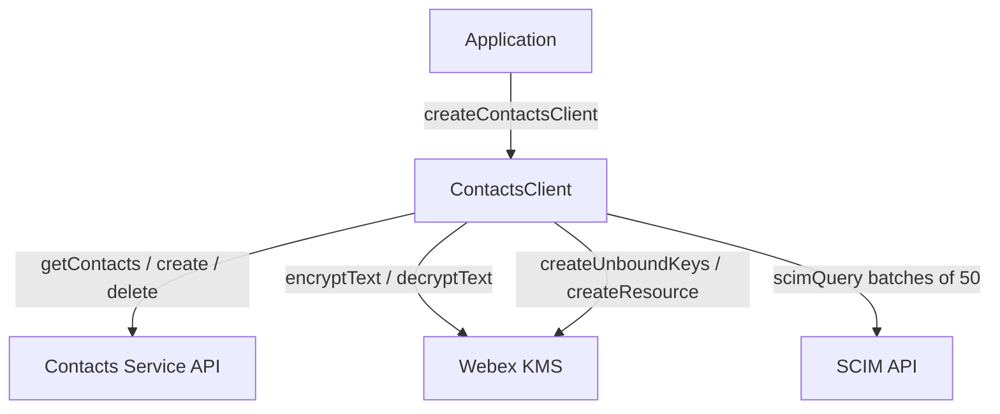
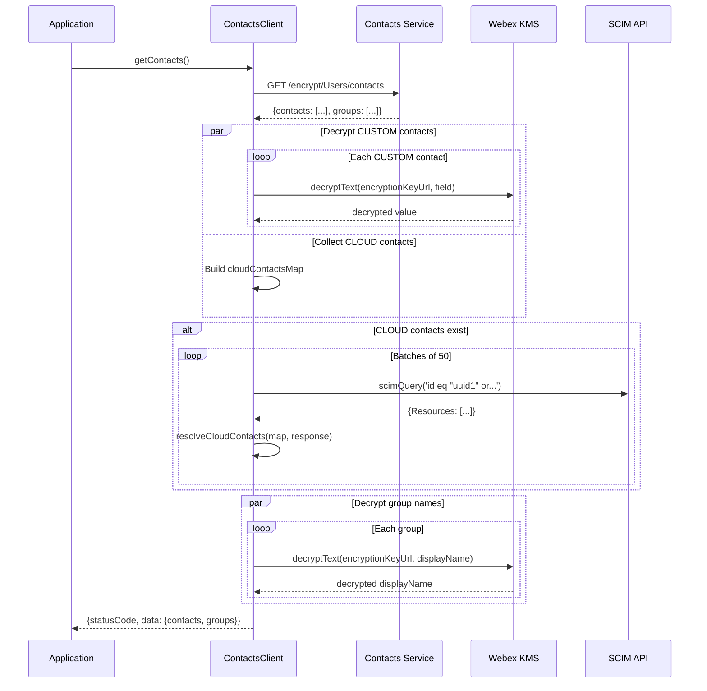
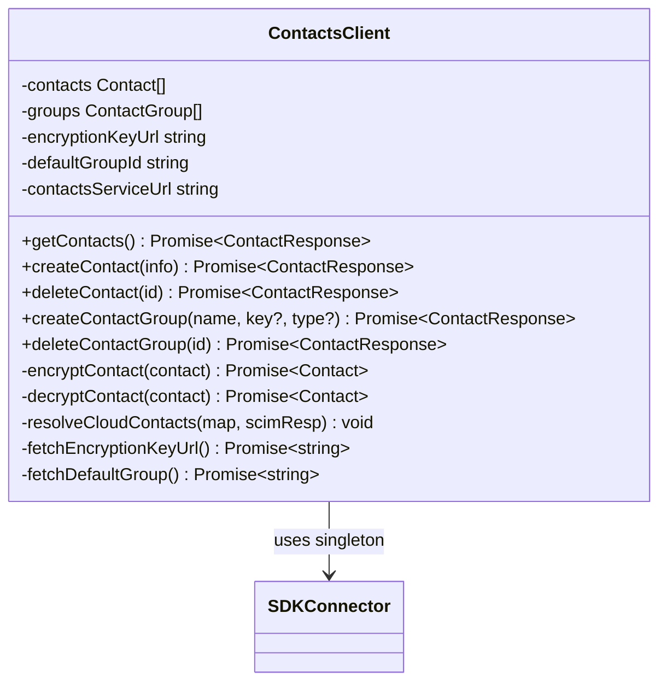

<!-- ───────────────────────────────
  Template:     Module Spec
  Template-ID:  module-spec
  Generates:    packages/calling/src/Contacts/ai-docs/contacts-spec.md
  Description:  Canonical spec for the Contacts module.
  Library ver:  0.2.0
  Last updated: 2026-07-03
─────────────────────────────── -->

# Contacts — SPEC

> Start here → root [`AGENTS.md`](../../../AGENTS.md) (agent entry) · router [`SPEC_INDEX.md`](../../ai-docs/SPEC_INDEX.md) · system [`calling-spec.md`](../../ai-docs/calling-spec.md). This is the Contacts canonical spec.

## Metadata

| Field | Value |
|---|---|
| Module id | `Contacts` |
| Source path(s) | `packages/calling/src/Contacts/` |
| Doc kind | Module spec |
| Coverage score | Specced |
| Generated from | `module-spec` @ SDLC template library `0.2.0` |
| generated_by / approved_by / updated_at | migrated from `Contacts/ai-docs/AGENTS.md` + `ARCHITECTURE.md` / pending / 2026-07-03 |
| Validation status | not-run |

## Evidence Rules

Every requirement cites `file path`. Test evidence preferred for WHY.

## Source Material Register

| Source doc | Scope | Decision | Detail location or disposition |
|---|---|---|---|
| `Contacts/ai-docs/AGENTS.md` | overview, public API, types, examples | migrated | Overview, Public Surface, Use Cases |
| `Contacts/ai-docs/ARCHITECTURE.md` | component table, data flows, sequence diagrams, constants | migrated | Design Overview, Data Flow, Sequence Diagrams, Pitfalls |

## Overview

`ContactsClient` manages personal contacts and contact groups with transparent KMS encryption/decryption. It handles CRUD for both `CUSTOM` (user-created, fully encrypted) and `CLOUD` (Webex directory, encrypted + SCIM-resolved) contacts. Contact group management includes automatic default group creation.

All contact and group data is encrypted via Webex KMS before storage. CLOUD contacts are additionally resolved via SCIM queries (batched in groups of 50) to populate display names, phone numbers, SIP addresses, and other directory fields.

**Factory:** `createContactsClient(webex, logger) → IContacts`

## Purpose / Responsibility

Owns CRUD for user contacts and contact groups with transparent encryption, CLOUD contact resolution via SCIM, and local in-memory cache management. Does NOT own group-based permissions or messaging.

## Stack

TypeScript, Jest/jsdom. Encryption via `webex.internal.encryption.kms`.

## Folder / Package Structure

```
Contacts/
├── ContactsClient.ts          # Main class with all public and private methods
├── ContactsClient.test.ts     # Unit tests
├── types.ts                   # IContacts, Contact, ContactGroup, ContactResponse, enums
├── constants.ts               # Endpoint filters, encrypted fields enum, SCIM constants
├── contactFixtures.ts         # Test fixtures
└── ai-docs/
    ├── contacts-spec.md       # This file (canonical spec)
    ├── AGENTS.md              # Original agent doc
    └── ARCHITECTURE.md        # Original architecture doc
```

## Key Files (source of truth)

| File | Holds |
|---|---|
| `types.ts` | `IContacts`, `Contact`, `ContactGroup`, `ContactResponse`, `ContactType`, `GroupType` |
| `constants.ts` | `ENCRYPT_FILTER`, `USERS` (capital U!), `CONTACT_FILTER`, `GROUP_FILTER`, `DEFAULT_GROUP_NAME`, `CONTACTS_SCHEMA`, `encryptedFields` enum, `SCIM_ID_FILTER` |

## Public Surface

| Contract ID | Type | Surface | Purpose | Compatibility | Schema | Root index |
|---|---|---|---|---|---|---|
| `Contacts.getContacts` | SDK | `(): Promise<ContactResponse>` | Fetch all contacts and groups | stable | `types.ts#IContacts` | `SPEC_INDEX.md` |
| `Contacts.createContact` | SDK | `(info: Contact): Promise<ContactResponse>` | Create contact | stable | `types.ts#Contact` | `SPEC_INDEX.md` |
| `Contacts.deleteContact` | SDK | `(contactId: string): Promise<ContactResponse>` | Delete a contact | stable | `types.ts` | `SPEC_INDEX.md` |
| `Contacts.createContactGroup` | SDK | `(displayName, encryptionKeyUrl?, groupType?): Promise<ContactResponse>` | Create a group | stable | `types.ts#ContactGroup` | `SPEC_INDEX.md` |
| `Contacts.deleteContactGroup` | SDK | `(groupId: string): Promise<ContactResponse>` | Delete a group | stable | `types.ts` | `SPEC_INDEX.md` |

## Requires (dependencies)

- **Internal**: `SDKConnector` (singleton), `Logger`, `scimQuery` (from `common/Utils.ts`), `serviceErrorCodeHandler`, `uploadLogs`
- **External**: Contacts Service API (`/encrypt/Users/`), Webex KMS (`webex.internal.encryption.kms`), SCIM API

## Requirements

| ID | WHAT | WHY | Source Evidence | Test / Example Evidence | Assumptions / Gaps | Confidence |
|---|---|---|---|---|---|---|
| `CT-R-001` | Both `CUSTOM` and `CLOUD` contacts MUST be encrypted via `encryptContact()` before posting | Contacts service requires encrypted data for all contact types; CLOUD contacts are resolved client-side after storage | `ContactsClient.ts` (encryptContact called for both types) | `ContactsClient.test.ts` | none | PRESENT |
| `CT-R-002` | `createContact()` with `contactType: CLOUD` MUST require `contactId`; absent `contactId` MUST return `statusCode: 400` | CLOUD contacts are Webex directory users; their ID is the SCIM ID | `ContactsClient.ts` | `ContactsClient.test.ts` | none | PRESENT |
| `CT-R-003` | `getContacts()` MUST decrypt CUSTOM contacts and resolve CLOUD contacts via SCIM in batches of 50 | CLOUD contact fields are stored encrypted; SCIM provides display-ready fields | `ContactsClient.ts` (resolveCloudContacts, scimQuery) | `ContactsClient.test.ts` | none | PRESENT |
| `CT-R-004` | Encryption key resolution MUST follow order: cached key → groups[0].encryptionKeyUrl → auto-create KMS key + default group | Avoids unnecessary KMS calls; creates default group only when none exists | `ContactsClient.ts` (fetchEncryptionKeyUrl) | `ContactsClient.test.ts` | none | PRESENT |
| `CT-R-005` | `createContactGroup()` MUST check for duplicate group names and return `statusCode: 400` on duplicate | Duplicate groups confuse contact assignment | `ContactsClient.ts` | `ContactsClient.test.ts` | none | PRESENT |
| `CT-R-006` | All API URLs MUST use `USERS` constant (`'Users'` with capital U) | Contacts service API path is case-sensitive; `users` (lowercase) returns 404 | `ContactsClient.ts`, `constants.ts#USERS` | `ContactsClient.test.ts` | none | PRESENT |
| `CT-R-007` | Local cache (`this.contacts`, `this.groups`) MUST be updated on every create and delete operation | Subsequent operations (e.g., duplicate check, default group) depend on in-memory state | `ContactsClient.ts` | `ContactsClient.test.ts` | none | PRESENT |
| `CT-R-008` | SCIM queries MUST be batched: max 50 contacts per query using `id eq "uuid1" or id eq "uuid2"...` filter | SCIM has query length limits | `ContactsClient.ts` (scimQuery batch logic) | `ContactsClient.test.ts` | none | PRESENT |

## Design Overview

`ContactsClient` is a single-class module with CRUD methods backed by the contacts service. It maintains in-memory state for contacts, groups, encryption key URL, and default group ID. All network calls use `webex.request()` (no browser `fetch`). The class implements a lazy encryption key resolution pattern to avoid KMS calls when keys are already cached.

## Data Flow



## Sequence Diagram(s)

Sequence coverage:

| Operation group | Diagram | Failure / recovery coverage |
|---|---|---|
| Fetch contacts (CUSTOM + CLOUD) | Fetch sequence | SCIM failure → `resolved: false` |
| Create CUSTOM contact | Create CUSTOM sequence | Missing encryption key → auto-create |
| Create CLOUD contact | Create CLOUD sequence | Missing contactId → 400 |
| Create group | Create group sequence | Duplicate name → 400 |



## Class / Component Relationships



## Use Cases

- **UC-1 Fetch all contacts and groups:** `contactClient.getContacts()` — decrypts CUSTOM, resolves CLOUD via SCIM. Evidence: `ContactsClient.ts`, `ContactsClient.test.ts`.
- **UC-2 Create a CUSTOM contact:** `createContact({contactType: CUSTOM, encryptionKeyUrl: '...', ...})` — encrypts all fields, posts to contacts service. Evidence: `ContactsClient.ts`.
- **UC-3 Create a CLOUD contact:** `createContact({contactType: CLOUD, contactId: 'scim-uuid', ...})` — encrypts, posts, then resolves via SCIM. Evidence: `ContactsClient.ts`.
- **UC-4 Create group:** `createContactGroup('Team Alpha')` — encrypts display name, checks for duplicate, creates group. Evidence: `ContactsClient.ts`.
- **UC-5 Auto-create default group:** When no groups exist, `fetchEncryptionKeyUrl()` creates KMS key + resource + default `'Other contacts'` group. Evidence: `ContactsClient.ts`.

## Business Rules & Invariants

- `USERS` constant is `'Users'` (capital U) — ALL contacts service URLs use capital U.
- Both CUSTOM and CLOUD contacts are encrypted before POSTing — CLOUD contacts are resolved via SCIM after retrieval.
- Encryption key resolution is cached — call `fetchEncryptionKeyUrl()` to get the key; never re-fetch if `this.encryptionKeyUrl` is set.
- Duplicate group name check uses the in-memory `this.groups` — stale cache can miss duplicates created by another session.

## Concurrency & Reactive Flow

In-memory state (`this.contacts`, `this.groups`) is not thread-safe across concurrent requests — single-threaded JS runtime makes this acceptable in practice, but concurrent calls to `createContact` could produce race conditions. Evidence: `ContactsClient.ts` (no explicit mutex).

## Error Handling & Failure Modes

| Condition | Signal | Caller recovery |
|---|---|---|
| CLOUD contact created without `contactId` | `statusCode: 400` | Provide the SCIM UUID as `contactId` |
| Duplicate group name | `statusCode: 400` | Use a unique group name |
| SCIM query fails for a contact | `contact.resolved = false` | Non-fatal; display available data |
| KMS key creation failure | Error in `ContactResponse.data.error` | Check encryption plugin initialization |
| Contacts service unreachable | Error in response | Retry; check service URL resolution |

## Pitfalls

- `USERS` constant is `'Users'` (capital U) — lowercase `users` breaks all API paths.
- Both CUSTOM and CLOUD contacts are encrypted — it is NOT correct to skip encryption for CLOUD contacts thinking they're already "public".
- SCIM resolution failure is non-fatal — unresolved contacts return with `resolved: false` and no display fields. Callers should handle this gracefully.
- Duplicate group check uses in-memory `this.groups` — if another session created a group, the in-memory check won't catch it (server will return an error on collision).
- Deleting a contact uses `findIndex` + `splice` on the local cache — if the local cache is out of sync, the local delete succeeds even if the server delete failed.

## Test-Case Strategy (module)

Unit tests in `ContactsClient.test.ts`. Uses `getTestUtilsWebex()`. Key coverage: CRUD paths, encryption for both types, SCIM batch resolution, default group creation, duplicate group check, CLOUD contact missing ID.

| Behavior / Requirement | Existing test evidence | Gap |
|---|---|---|
| `CT-R-001` Both types encrypted | `ContactsClient.test.ts` | none |
| `CT-R-002` CLOUD missing contactId → 400 | `ContactsClient.test.ts` | none |
| `CT-R-003` SCIM resolution batched | `ContactsClient.test.ts` | none |
| `CT-R-004` Key resolution order | `ContactsClient.test.ts` | none |
| `CT-R-005` Duplicate group → 400 | `ContactsClient.test.ts` | none |
| `CT-R-006` USERS capital U | `ContactsClient.test.ts` (URL assertions) | none |
| `CT-R-007` Cache updated on CRUD | `ContactsClient.test.ts` | concurrent request race not tested |
| `CT-R-008` SCIM batch size 50 | `ContactsClient.test.ts` | none |

## Traceability

- Repo architecture: `../../ai-docs/calling-spec.md` · Registry: `../../ai-docs/SPEC_INDEX.md`
- Coverage state: `.sdd/manifest.json` (pending)
