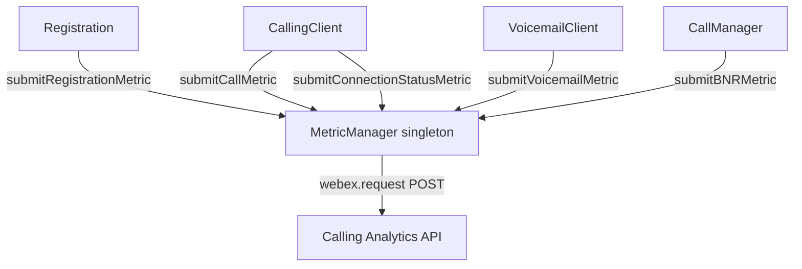
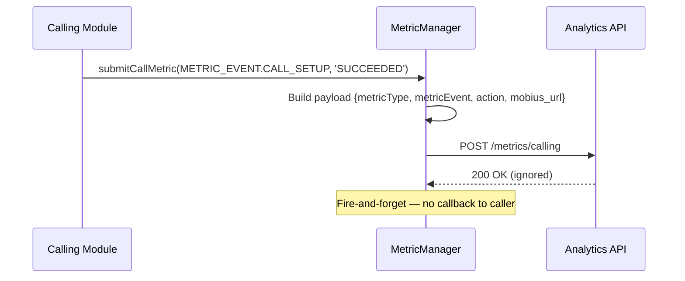
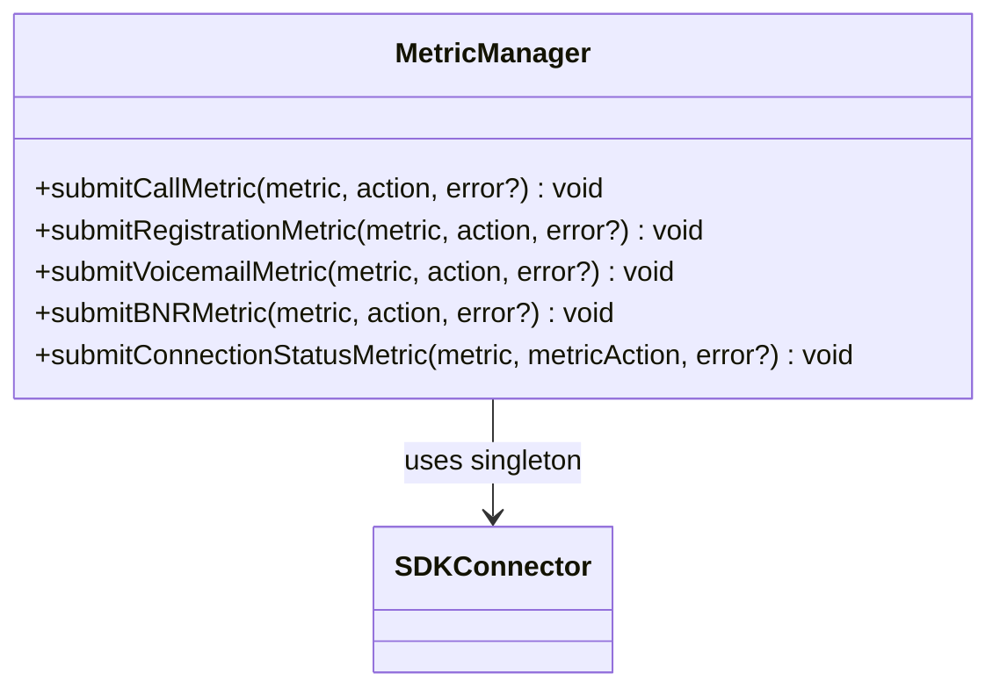

<!-- ───────────────────────────────
  Template:     Module Spec
  Template-ID:  module-spec
  Generates:    packages/calling/src/Metrics/ai-docs/metrics-spec.md
  Description:  Canonical spec for the Metrics (MetricManager) module.
  Library ver:  0.2.0
  Last updated: 2026-07-03
─────────────────────────────── -->

# Metrics (MetricManager) — SPEC

> Start here → root [`AGENTS.md`](../../../AGENTS.md) (agent entry) · router [`SPEC_INDEX.md`](../../ai-docs/SPEC_INDEX.md) · system [`calling-spec.md`](../../ai-docs/calling-spec.md). This is the Metrics canonical spec.

## Metadata

| Field | Value |
|---|---|
| Module id | `Metrics` |
| Source path(s) | `packages/calling/src/Metrics/` |
| Doc kind | Module spec |
| Coverage score | Specced |
| Generated from | `module-spec` @ SDLC template library `0.2.0` |
| generated_by / approved_by / updated_at | migrated from `Metrics/ai-docs/AGENTS.md` / pending / 2026-07-03 |
| Validation status | not-run |

## Evidence Rules

Every requirement cites `file path`. Test evidence preferred for WHY.

## Source Material Register

| Source doc | Scope | Decision | Detail location or disposition |
|---|---|---|---|
| `Metrics/ai-docs/AGENTS.md` | overview, public API, enums, singleton pattern, per-method variations | migrated | All sections below |

## Overview

`MetricManager` is the singleton metrics submission service for `@webex/calling`. It collects behavioral events (call setup, registration, voicemail, BNR, connection state changes) and forwards them to the Calling Analytics pipeline.

Consumers access it via `getMetricManager()` — the singleton is initialized once and shared across all modules. Five distinct submit methods cover five metric categories; each has its own enum, payload shape, and send logic.

**Factory / Singleton accessor:** `getMetricManager(webex?, logger?) → IMetricManager`

## Purpose / Responsibility

Owns all telemetry submission for the calling SDK. Does NOT own event routing, call state, or business logic. All other modules import and call into MetricManager; MetricManager never calls into other domain modules.

## Stack

TypeScript, Jest/jsdom. No runtime deps beyond Webex SDK.

## Folder / Package Structure

```
Metrics/
├── MetricManager.ts            # Singleton class with all submit methods
├── MetricManager.test.ts       # Unit tests
├── types.ts                    # IMetricManager, all metric payload types
├── constants.ts                # METRIC_TYPE, METRIC_EVENT, REG_ACTION, CONNECTION_ACTION, VOICEMAIL_ACTION, BNR_ACTION enums
└── ai-docs/
    ├── metrics-spec.md         # This file (canonical spec)
    └── AGENTS.md               # Original agent doc
```

## Key Files (source of truth)

| File | Holds |
|---|---|
| `types.ts` | `IMetricManager`, metric payload types |
| `constants.ts` | `METRIC_TYPE`, `METRIC_EVENT`, `REG_ACTION`, `CONNECTION_ACTION`, `VOICEMAIL_ACTION`, `BNR_ACTION` enums |

## Public Surface

| Contract ID | Type | Surface | Purpose | Compatibility | Schema | Root index |
|---|---|---|---|---|---|---|
| `MetricManager.submitCallMetric` | SDK | `(metric: METRIC_EVENT, action: string, callError?: CallError): void` | Submit call setup/teardown events | stable | `types.ts#IMetricManager` | `SPEC_INDEX.md` |
| `MetricManager.submitRegistrationMetric` | SDK | `(metric: REG_ACTION, action: string, regError?: RegError): void` | Submit registration events | stable | `types.ts#IMetricManager` | `SPEC_INDEX.md` |
| `MetricManager.submitVoicemailMetric` | SDK | `(metric: VOICEMAIL_ACTION, action: string, error?: VoicemailError): void` | Submit voicemail action events | stable | `types.ts#IMetricManager` | `SPEC_INDEX.md` |
| `MetricManager.submitBNRMetric` | SDK | `(metric: BNR_ACTION, action: string, error?: BNRError): void` | Submit background noise reduction events | stable | `types.ts#IMetricManager` | `SPEC_INDEX.md` |
| `MetricManager.submitConnectionStatusMetric` | SDK | `(metric: CONNECTION_ACTION, metricAction: string, error?: ConnectionError): void` | Submit connection state change events | stable | `types.ts#IMetricManager` | `SPEC_INDEX.md` |

Singleton accessor:

| Contract ID | Type | Surface | Purpose | Compatibility | Schema | Root index |
|---|---|---|---|---|---|---|
| `getMetricManager` | Factory | `(webex?, logger?) → IMetricManager` | Get or init the singleton | stable | `Metrics/types.ts` | `SPEC_INDEX.md` |

## Requires (dependencies)

- **Internal**: `SDKConnector` (singleton)
- **External**: Calling Analytics API (via `webex.request()`)

## Requirements

| ID | WHAT | WHY | Source Evidence | Test / Example Evidence | Assumptions / Gaps | Confidence |
|---|---|---|---|---|---|---|
| `MT-R-001` | `MetricManager` MUST be a singleton — `getMetricManager(webex, logger)` initializes on first call; subsequent calls return the same instance | All SDK modules share metric context; multiple instances would create inconsistent metric sequences | `MetricManager.ts` (singleton pattern) | `MetricManager.test.ts` | none | PRESENT |
| `MT-R-002` | `submitCallMetric()` MUST include `mobius_url` in the metric payload | Call metrics are server-correlated by Mobius URL for routing analysis | `MetricManager.ts` | `MetricManager.test.ts` | none | PRESENT |
| `MT-R-003` | `submitVoicemailMetric()` MUST NOT include `mobius_url` in the payload | Voicemail calls don't route through Mobius; the field would be stale/meaningless | `MetricManager.ts` (voicemail branch has no mobius_url) | `MetricManager.test.ts` | none | PRESENT |
| `MT-R-004` | `submitConnectionStatusMetric()` MUST use the literal string key `"metricAction"` in its payload — NOT the `action` parameter directly | Connection metric schema differs from other types: the field name IS `metricAction` | `MetricManager.ts` (connection submit) | `MetricManager.test.ts` | none | PRESENT |
| `MT-R-005` | `submitBNRMetric()` MUST NOT include an `action` tag in the metric payload | BNR metric schema does not define an action field | `MetricManager.ts` (BNR submit) | `MetricManager.test.ts` | none | PRESENT |
| `MT-R-006` | All error payloads MUST be accessed via `error?.message`, NOT `error?.toString()` or direct error object serialization | Metric pipeline expects structured string messages; raw error objects are not serializable | `MetricManager.ts` (error access pattern) | `MetricManager.test.ts` | none | PRESENT |
| `MT-R-007` | `METRIC_TYPE` enum MUST be used to set the metric category tag — not hardcoded strings | Enum ensures consistent category names across the pipeline | `MetricManager.ts`, `constants.ts#METRIC_TYPE` | `MetricManager.test.ts` | none | PRESENT |

## Design Overview

`MetricManager` is a stateless dispatcher: each submit method builds a payload object from enum values and optional error fields, then calls `webex.request()` to the analytics endpoint. No internal queuing or retry logic — fire-and-forget. The singleton guarantee is enforced by a module-level reference.

## Data Flow



## Sequence Diagram(s)



## Class / Component Relationships



## Use Cases

- **UC-1 Call setup metric:** On successful call setup: `metricManager.submitCallMetric(METRIC_EVENT.CALL_SETUP, REG_ACTION.REGISTER)`. Evidence: `MetricManager.ts`.
- **UC-2 Registration failure metric:** On registration 401: `metricManager.submitRegistrationMetric(REG_ACTION.REGISTER, action, regError)`. Evidence: `MetricManager.ts`.
- **UC-3 Voicemail list metric:** After `getVoicemailList()`: `metricManager.submitVoicemailMetric(VOICEMAIL_ACTION.FETCH, action)`. Evidence: `VoicemailClient.ts`.
- **UC-4 Connection state change:** When Mobius WSS reconnects: `metricManager.submitConnectionStatusMetric(CONNECTION_ACTION.CONNECTED, 'mobiusSocket')`. Evidence: `MetricManager.ts`.

## Business Rules & Invariants

- MetricManager is a **singleton** — never instantiate directly with `new MetricManager()`.
- `submitVoicemailMetric` omits `mobius_url` — this is intentional per schema.
- `submitConnectionStatusMetric` uses literal `"metricAction"` key — NOT the `action` variable name.
- `submitBNRMetric` omits the `action` tag — this is intentional per BNR metric schema.
- All submit methods are fire-and-forget — return `void`, no awaiting needed.

## Error Handling & Failure Modes

| Condition | Signal | Caller recovery |
|---|---|---|
| Analytics API unreachable | Silent failure (fire-and-forget) | No recovery needed; metrics are non-critical |
| `webex` not initialized before `getMetricManager` | Error thrown | Call `getMetricManager(webex, logger)` with valid webex instance |
| Error object without `.message` | `undefined` submitted (no throw) | Non-fatal; error field is optional in all schemas |

## Pitfalls

- `submitConnectionStatusMetric` uses `"metricAction"` as the literal key name in the payload — do not rename to `action` when reading or writing the payload.
- `submitVoicemailMetric` has no `mobius_url` field — adding it breaks the voicemail metric schema.
- `submitBNRMetric` has no `action` tag — adding it would create an unexpected field in the BNR schema.
- Error access pattern is `error?.message` — `error?.toString()` produces `[object Object]` in the metric pipeline.
- All five submit methods look similar but have distinct payload shapes — copy-paste from one to another will likely produce an incorrect payload.

## Test-Case Strategy (module)

Unit tests in `MetricManager.test.ts`. Key coverage: singleton initialization, each submit method payload, per-method schema deviations (voicemail no mobius_url, connection metricAction key, BNR no action tag), error field access.

| Behavior / Requirement | Existing test evidence | Gap |
|---|---|---|
| `MT-R-001` Singleton | `MetricManager.test.ts` | none |
| `MT-R-002` Call metric includes mobius_url | `MetricManager.test.ts` | none |
| `MT-R-003` Voicemail metric no mobius_url | `MetricManager.test.ts` | none |
| `MT-R-004` Connection literal metricAction | `MetricManager.test.ts` | none |
| `MT-R-005` BNR no action tag | `MetricManager.test.ts` | none |
| `MT-R-006` Error access via `.message` | `MetricManager.test.ts` | none |
| `MT-R-007` METRIC_TYPE enum used | `MetricManager.test.ts` | none |

## Traceability

- Repo architecture: `../../ai-docs/calling-spec.md` · Registry: `../../ai-docs/SPEC_INDEX.md`
- Coverage state: `.sdd/manifest.json` (pending)
