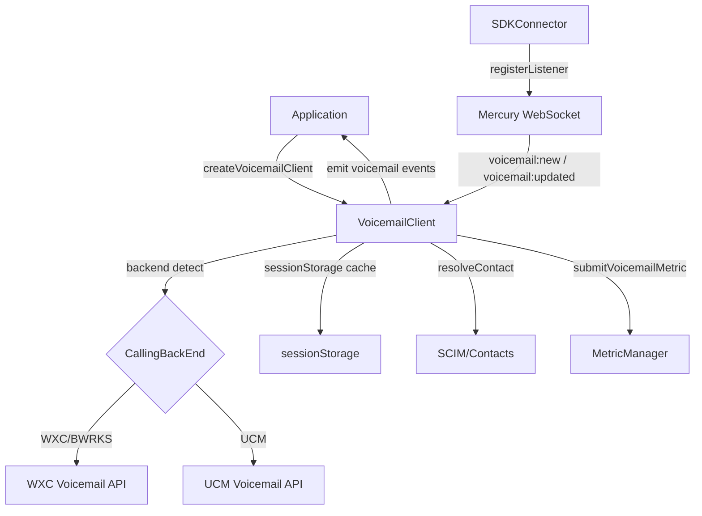
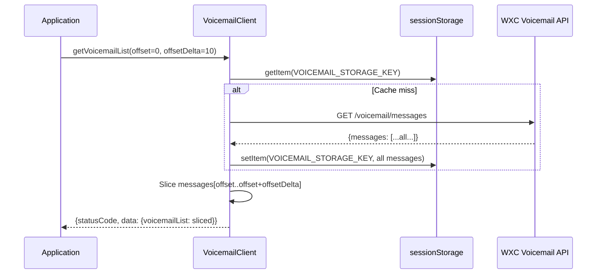
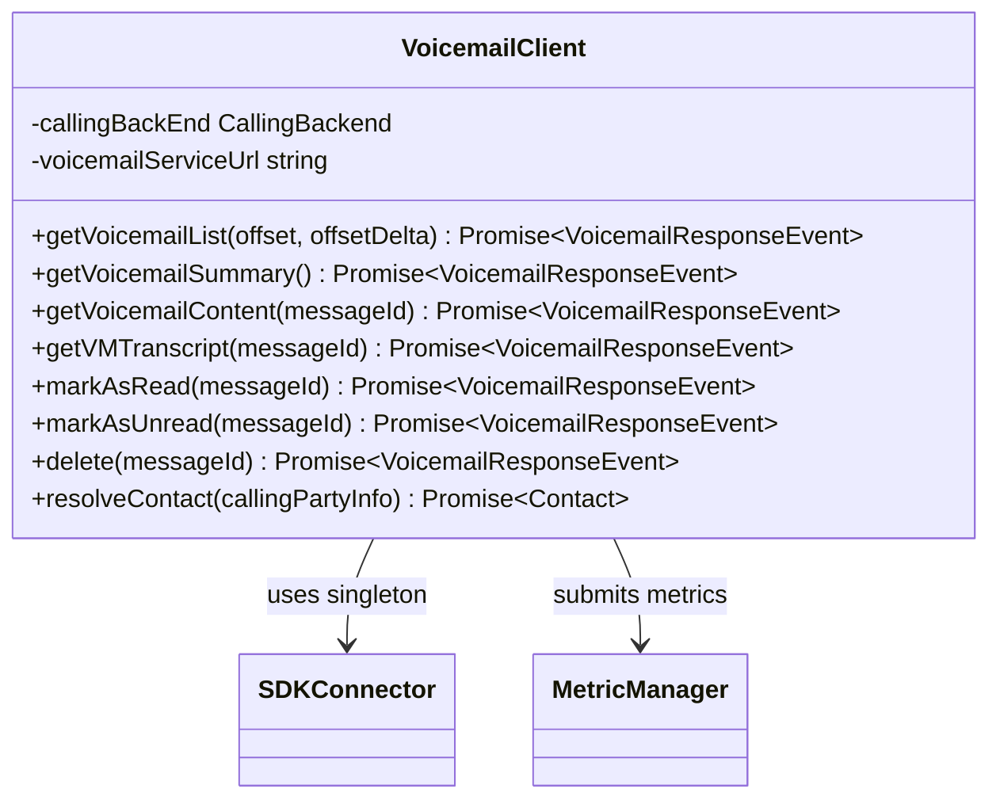

<!-- ───────────────────────────────
  Template:     Module Spec
  Template-ID:  module-spec
  Generates:    packages/calling/src/Voicemail/ai-docs/voicemail-spec.md
  Description:  Canonical spec for the Voicemail module.
  Library ver:  0.2.0
  Last updated: 2026-07-03
─────────────────────────────── -->

# Voicemail — SPEC

> Start here → root [`AGENTS.md`](../../../AGENTS.md) (agent entry) · router [`SPEC_INDEX.md`](../../ai-docs/SPEC_INDEX.md) · system [`calling-spec.md`](../../ai-docs/calling-spec.md). This is the Voicemail canonical spec.

## Metadata

| Field | Value |
|---|---|
| Module id | `Voicemail` |
| Source path(s) | `packages/calling/src/Voicemail/` |
| Doc kind | Module spec |
| Coverage score | Specced |
| Generated from | `module-spec` @ SDLC template library `0.2.0` |
| generated_by / approved_by / updated_at | migrated from `Voicemail/ai-docs/AGENTS.md` / pending / 2026-07-03 |
| Validation status | not-run |

## Evidence Rules

Every requirement cites `file path`. Test evidence preferred for WHY.

## Source Material Register

| Source doc | Scope | Decision | Detail location or disposition |
|---|---|---|---|
| `Voicemail/ai-docs/AGENTS.md` | overview, public API, types, backend matrix, pagination, metrics | migrated | All sections below |

## Overview

`Voicemail` provides cross-backend APIs for listing, playing, managing, and deleting voicemail messages. It supports three backends: **WXC** (Cisco Webex Calling), **UCM** (Unified CM), and **BWRKS** (BroadWorks), selected at construction from `getCallingBackEnd()`. WXC uses client-side pagination with `sessionStorage` caching; UCM uses server-side pagination.

**Factory:** `createVoicemailClient(webex, logger) → IVoicemail`

## Purpose / Responsibility

Owns CRUD and audio streaming for voicemail messages across WXC/UCM/BWRKS backends. Does NOT own call control or registration.

## Stack

TypeScript, Jest/jsdom. `sessionStorage` for WXC pagination caching.

## Folder / Package Structure

```
Voicemail/
├── VoicemailClient.ts          # Main class, backend delegation
├── VoicemailClient.test.ts     # Unit tests
├── types.ts                    # IVoicemail, VoicemailResponseEvent, MessageInfo, SummaryInfo, CallingPartyInfo
├── constants.ts                # Endpoints, storage keys, limits
├── voicemailFixtures.ts        # Test fixtures
└── ai-docs/
    ├── voicemail-spec.md       # This file (canonical spec)
    └── AGENTS.md               # Original agent doc
```

## Key Files (source of truth)

| File | Holds |
|---|---|
| `types.ts` | `IVoicemail`, `VoicemailResponseEvent`, `SummaryInfo`, `MessageInfo`, `CallingPartyInfo`, `VoicemailList`, `VoicemailQuery` |
| `constants.ts` | `VOICEMAIL_CONTENT_URL_WXC`, `VOICEMAIL_STORAGE_KEY`, `VOICEMAIL_MESSAGES_PAGE_SIZE` |

## Public Surface

| Contract ID | Type | Surface | Purpose | Compatibility | Schema | Root index |
|---|---|---|---|---|---|---|
| `Voicemail.getVoicemailList` | SDK | `(offset: number, offsetDelta: number): Promise<VoicemailResponseEvent>` | Get paginated voicemail list | stable | `types.ts#IVoicemail` | `SPEC_INDEX.md` |
| `Voicemail.getVoicemailSummary` | SDK | `(): Promise<VoicemailResponseEvent>` | Get unread/total message counts | stable | `types.ts#SummaryInfo` | `SPEC_INDEX.md` |
| `Voicemail.getVoicemailContent` | SDK | `(messageId: string): Promise<VoicemailResponseEvent>` | Get audio URL for a message | stable | `types.ts` | `SPEC_INDEX.md` |
| `Voicemail.getVMTranscript` | SDK | `(messageId: string): Promise<VoicemailResponseEvent>` | Get transcript for a message | stable | `types.ts` | `SPEC_INDEX.md` |
| `Voicemail.markAsRead` | SDK | `(messageId: string): Promise<VoicemailResponseEvent>` | Mark message read | stable | `types.ts` | `SPEC_INDEX.md` |
| `Voicemail.markAsUnread` | SDK | `(messageId: string): Promise<VoicemailResponseEvent>` | Mark message unread | stable | `types.ts` | `SPEC_INDEX.md` |
| `Voicemail.delete` | SDK | `(messageId: string): Promise<VoicemailResponseEvent>` | Delete a voicemail | stable | `types.ts` | `SPEC_INDEX.md` |
| `Voicemail.resolveContact` | SDK | `(callingPartyInfo: CallingPartyInfo): Promise<Contact \| undefined>` | Resolve caller info via SCIM/contacts | stable | `types.ts#CallingPartyInfo` | `SPEC_INDEX.md` |

## Requires (dependencies)

- **Internal**: `SDKConnector` (singleton), `Logger`, `MetricManager`, `getCallingBackEnd`, `serviceErrorCodeHandler`, `uploadLogs`
- **External**: Voicemail REST APIs (WXC/UCM/BWRKS paths differ), Mercury WebSocket (voicemail notifications), `sessionStorage` (WXC pagination cache)

## Requirements

| ID | WHAT | WHY | Source Evidence | Test / Example Evidence | Assumptions / Gaps | Confidence |
|---|---|---|---|---|---|---|
| `VM-R-001` | Constructor MUST select backend connector via `getCallingBackEnd(webex)` and initialize the correct endpoint URLs | WXC/UCM/BWRKS use distinct API paths and auth patterns | `VoicemailClient.ts` (initializeBackend) | `VoicemailClient.test.ts` | none | PRESENT |
| `VM-R-002` | WXC `getVoicemailList()` MUST cache the full message list in `sessionStorage` on first fetch and serve subsequent pages from cache | WXC API does not support offset-based pagination natively; client-side pagination via sessionStorage reduces API calls | `VoicemailClient.ts` (sessionStorage usage) | `VoicemailClient.test.ts` — pagination tests | none | PRESENT |
| `VM-R-003` | UCM `getVoicemailList()` MUST use server-side pagination via `offset` and `offsetDelta` query params | UCM supports server-side pagination; caching not needed | `VoicemailClient.ts` (UCM path) | `VoicemailClient.test.ts` | none | PRESENT |
| `VM-R-004` | WXC `getVoicemailContent()` `messageId` MUST use the path format `{vm-url}/{userId}/{messageId}/content` (no query params) | WXC voicemail content endpoint uses path segments, not query params | `VoicemailClient.ts`, `constants.ts#VOICEMAIL_CONTENT_URL_WXC` | `VoicemailClient.test.ts` | none | PRESENT |
| `VM-R-005` | Every public API call MUST submit voicemail metrics via `MetricManager.submitVoicemailMetric()` with the appropriate `VOICEMAIL_ACTION` | Usage and error analytics for all voicemail operations | `VoicemailClient.ts` (metric calls throughout) | `VoicemailClient.test.ts` | none | PRESENT |
| `VM-R-006` | `resolveContact()` MUST attempt SCIM lookup first, falling back to contacts cache; MUST return `undefined` on lookup failure without throwing | Contact resolution is best-effort for display enrichment only | `VoicemailClient.ts` | `VoicemailClient.test.ts` | none | PRESENT |
| `VM-R-007` | `markAsRead()` and `markAsUnread()` MUST update the local `sessionStorage` cache entry for WXC to keep pagination state consistent | Cache invalidation is required to prevent stale read-state on paginated views | `VoicemailClient.ts` (cache update logic) | `VoicemailClient.test.ts` | none | PRESENT |
| `VM-R-008` | BWRKS backend MUST delegate to WXC-equivalent endpoints for all operations (WXC and BWRKS share the same API surface) | Broadworks Calling uses the same endpoint structure as WXC | `VoicemailClient.ts` (BWRKS = WXC branch) | `VoicemailClient.test.ts` | none | PRESENT |

## Design Overview

`VoicemailClient` is a single class that branches at each public method based on `this.callingBackEnd`. WXC and BWRKS share the same implementation branch. UCM uses a distinct pagination and URL scheme. A `sessionStorage` keyed by `VOICEMAIL_STORAGE_KEY` holds the entire WXC voicemail list after the first fetch; pagination is applied client-side by slicing.

## Backend Feature Matrix

| Feature | WXC | BWRKS | UCM |
|---|---|---|---|
| `getVoicemailList` | ✓ (cached, client-paginated) | ✓ (same as WXC) | ✓ (server-paginated) |
| `getVoicemailSummary` | ✓ | ✓ | ✓ |
| `getVoicemailContent` | ✓ (path-based URL) | ✓ | ✓ |
| `getVMTranscript` | ✓ | ✓ | ✓ |
| `markAsRead` | ✓ (updates cache) | ✓ | ✓ |
| `markAsUnread` | ✓ (updates cache) | ✓ | ✓ |
| `delete` | ✓ (invalidates cache) | ✓ | ✓ |
| `resolveContact` | ✓ | ✓ | ✓ |

## Data Flow



## Sequence Diagram(s)

Sequence coverage:

| Operation group | Diagram | Failure / recovery coverage |
|---|---|---|
| WXC list with pagination | WXC list sequence | First fetch caches; subsequent pages from cache |
| UCM list | UCM list sequence | Server-side offset/delta |
| Mark as read (WXC) | Mark read sequence | Cache update on success |



## Class / Component Relationships



## Use Cases

- **UC-1 List and paginate voicemails:** `voicemail.getVoicemailList(0, 10)` → first page; `getVoicemailList(10, 10)` → second page from cache (WXC). Evidence: `VoicemailClient.ts`.
- **UC-2 Play a voicemail:** `voicemail.getVoicemailContent(messageId)` → audio URL. Evidence: `VoicemailClient.ts`.
- **UC-3 Mark as read:** `voicemail.markAsRead(messageId)` — updates server and local cache. Evidence: `VoicemailClient.ts`.
- **UC-4 Delete voicemail:** `voicemail.delete(messageId)` — removes from server and invalidates cache entry. Evidence: `VoicemailClient.ts`.
- **UC-5 Resolve caller name:** `voicemail.resolveContact(callingPartyInfo)` → display name + photo. Evidence: `VoicemailClient.ts`.

## Business Rules & Invariants

- WXC voicemail list is cached in `sessionStorage` as a whole on first page fetch — partial re-fetch is not implemented.
- `delete()` MUST remove the entry from `sessionStorage` cache to prevent stale pagination.
- WXC content URL is a path: `{baseUrl}/{userId}/{messageId}/content` — NOT a query param.
- BWRKS always uses the WXC code path — treat as identical.
- `getVoicemailSummary()` does NOT hit `sessionStorage` — always fetches fresh.

## Error Handling & Failure Modes

| Condition | Signal | Caller recovery |
|---|---|---|
| API authentication failure | `statusCode: 401` in `VoicemailResponseEvent` | Refresh token |
| `sessionStorage` quota exceeded | Catch `DOMException` → re-fetch and overwrite | Rare; only for large voicemail lists |
| `resolveContact` SCIM failure | Returns `undefined`; no throw | Show raw CallerID without enrichment |
| Backend detection returns unknown | Error thrown at construction | Verify calling service provisioning |

## Pitfalls

- WXC pagination is client-side via `sessionStorage` — if the app clears `sessionStorage`, the next `getVoicemailList()` will re-fetch the full list from API.
- WXC `messageId` in the content URL is a **path segment**, not a query param — constructing `?messageId=...` returns 404.
- BWRKS is NOT a distinct branch — it shares the WXC code path.
- `markAsRead`/`markAsUnread` MUST update the cache immediately or the paginated view will show stale read state.
- Metrics are submitted per-call regardless of success/failure — both success and error paths call `submitVoicemailMetric`.

## Test-Case Strategy (module)

Unit tests in `VoicemailClient.test.ts`. Key coverage: WXC list caching, UCM pagination, content URL format, cache invalidation on delete, metric submission on all paths, resolveContact failure handling.

| Behavior / Requirement | Existing test evidence | Gap |
|---|---|---|
| `VM-R-001` Backend selection | `VoicemailClient.test.ts` | none |
| `VM-R-002` WXC sessionStorage caching | `VoicemailClient.test.ts` | none |
| `VM-R-003` UCM server pagination | `VoicemailClient.test.ts` | none |
| `VM-R-004` WXC content URL format | `VoicemailClient.test.ts` | none |
| `VM-R-005` Metrics per-call | `VoicemailClient.test.ts` | none |
| `VM-R-006` resolveContact failure → undefined | `VoicemailClient.test.ts` | none |
| `VM-R-007` Cache update on markAsRead | `VoicemailClient.test.ts` | none |
| `VM-R-008` BWRKS = WXC path | `VoicemailClient.test.ts` | none |

## Traceability

- Repo architecture: `../../ai-docs/calling-spec.md` · Registry: `../../ai-docs/SPEC_INDEX.md`
- Coverage state: `.sdd/manifest.json` (pending)
