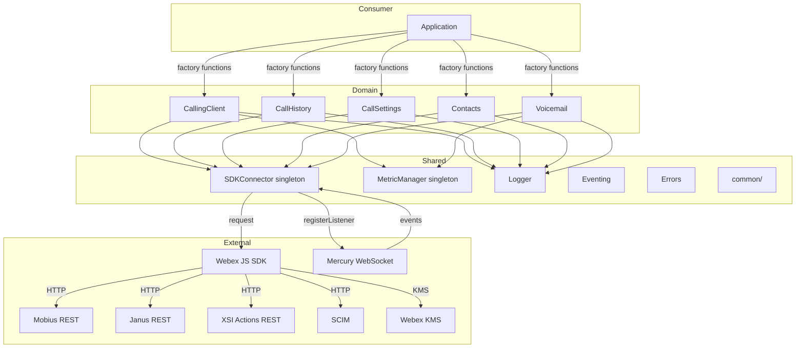
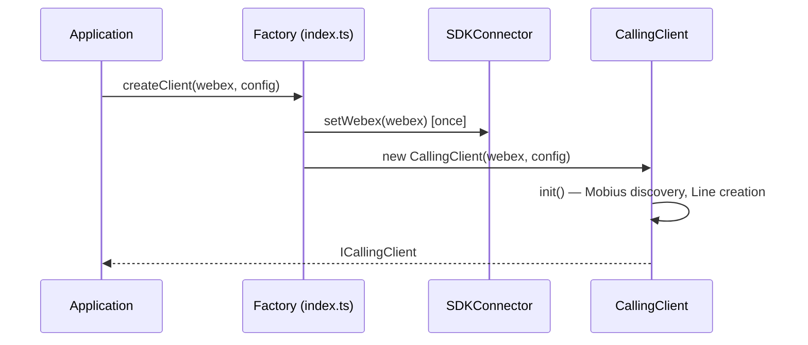
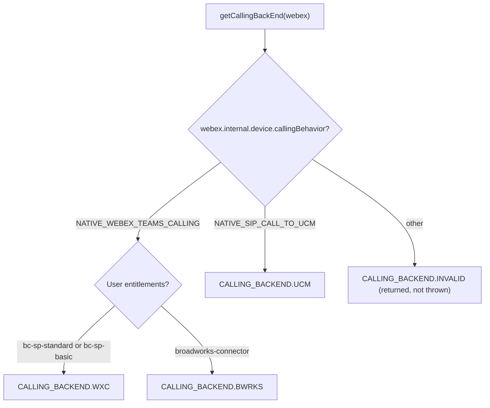

<!-- ───────────────────────────────
  Template:     Module Spec
  Template-ID:  module-spec
  Generates:    packages/calling/src/ai-docs/calling-spec.md
  Description:  Package-level canonical spec for @webex/calling — orientation, public surface, shared infrastructure, backend detection, event system, error hierarchy.
  Library ver:  0.2.0
  Last updated: 2026-07-03
─────────────────────────────── -->

# @webex/calling — SPEC

> Start here → root [`AGENTS.md`](../../AGENTS.md) (agent entry) · router [`SPEC_INDEX.md`](SPEC_INDEX.md) · this is the package-level canonical spec. For per-module detail load the relevant module spec from `SPEC_INDEX.md`.
> Context-efficiency: link to canonical docs — don't duplicate them.

## Metadata

| Field | Value |
|---|---|
| Module id | `calling` |
| Source path(s) | `packages/calling/src/` |
| Doc kind | Module spec |
| Coverage score | Partial — module specs exist for all primary domain modules; SDKConnector, Logger, Events, Errors, common are Partial |
| Generated from | `module-spec` @ SDLC template library `0.2.0` |
| generated_by / approved_by / updated_at | migrated from `src/ai-docs/ARCHITECTURE.md` + `src/ai-docs/AGENTS.md` / pending / 2026-07-03 |
| Validation status | not-run |

## Evidence Rules

Every requirement cites `file path` as source evidence. Test evidence preferred for WHY. If evidence is missing it is marked as `APPROVED_UNKNOWN`.

## Source Material Register

| Source doc | Scope | Decision | Detail location or disposition |
|---|---|---|---|
| `src/ai-docs/ARCHITECTURE.md` | architecture, infrastructure, file structure | migrated | Design Overview, Data Flow, Sequence Diagrams, Shared Infrastructure sections |
| `src/ai-docs/AGENTS.md` | overview, public API, factory functions, event system | migrated | Overview, Public Surface, Factory Functions, Event System sections |

## Overview

`@webex/calling` is a browser-based TypeScript SDK for Webex Calling services. It provides a unified API surface for line registration, real-time call control, call history, call settings, contacts management, and voicemail — working transparently across three calling backends: **Webex Calling (WXC)**, **Broadworks (BWRKS)**, and **Unified Communications Manager (UCM)**.

The package is organized as a modular monolith inside `packages/calling/src/`. Each subdirectory owns a domain concern and exposes its contract through TypeScript interfaces. Shared infrastructure (SDK bridge, logging, metrics, eventing, errors) is consumed by all domain modules.

Factory functions in `src/index.ts` are the only supported instantiation path — consumers never `new` a module class directly. Each factory internally calls `SDKConnector.setWebex(webex)` if not already initialized, so the SDK bridge is always established before the module runs.

## Purpose / Responsibility

Owns the Webex Calling SDK public surface: factory-created domain clients for line registration, call control, call history, call settings, contacts, and voicemail; shared infrastructure singletons (SDKConnector, Logger, Metrics, Eventing, Errors); and transparent multi-backend routing across WXC, BWRKS, and UCM. Does NOT own network transport or OAuth token management (delegated to Webex JS SDK).

## Stack

TypeScript (browser target), Jest (jsdom environment), Rollup build. Runtime peer: `webex` JS SDK. Key runtime deps: `@webex/internal-media-core` (WebRTC/ROAP), `xstate` (call + media state machines), `async-mutex` (registration serialization), `typed-emitter` (type-safe EventEmitter).

## Folder / Package Structure

```
packages/calling/src/
├── index.ts               # Consumer-facing public exports (factory functions, interfaces, types)
├── api.ts                 # Extended exports (adds concrete classes for API reference doc generation)
├── CallingClient/         # Orchestrator: registration + call control via Mobius
│   ├── line/              # Line class (registration + call bridge)
│   ├── registration/      # Registration class (Mobius device lifecycle + keepalive web worker)
│   └── calling/           # Call + CallManager + CallerId (XState FSMs, ROAP media)
├── CallHistory/           # Call history records (Janus API, real-time session events)
├── CallSettings/          # Call waiting, DND, call forwarding, voicemail settings (WXC/UCM)
├── Contacts/              # CRUD on contacts/groups with KMS encryption + SCIM resolution
├── Voicemail/             # Voicemail list/content/state/summary/transcript (WXC/BWRKS/UCM)
├── SDKConnector/          # Singleton bridge to Webex JS SDK (HTTP + Mercury WS)
├── Logger/                # Leveled structured logging wrapper
├── Metrics/               # Telemetry singleton (MetricManager)
├── Events/                # Typed EventEmitter base class (Eventing<T>) and event type maps
├── Errors/                # Error hierarchy (ExtendedError, CallError, LineError, CallingClientError)
└── common/                # Shared types, constants, utilities (backend detection, XSI, SCIM, error handlers)
```

## Key Files (source of truth)

| File | Holds |
|---|---|
| `src/index.ts` | All consumer-facing exports; authoritative public API surface |
| `src/api.ts` | API reference doc exports (not for consumers) |
| `src/Events/types.ts` | All event key enums and typed event maps — never hardcode raw event strings |
| `src/common/types.ts` | `CALLING_BACKEND`, `HTTP_METHODS`, `RegistrationStatus`, `ServiceIndicator`, shared interfaces |
| `src/common/constants.ts` | API path strings, entitlement keys, Webex base URLs |
| `src/common/Utils.ts` | `getCallingBackEnd()`, `handleCallErrors()`, `handleCallingClientErrors()`, SCIM/XSI utilities |
| `src/Errors/types.ts` | `ERROR_TYPE`, `ERROR_CODE`, error shape types |
| `src/CallingClient/constants.ts` | Mobius URLs, timeouts, timer constants |

## Public Surface

| Contract ID | Type | Surface | Purpose | Compatibility / deprecation | Schema / detail link | Root index |
|---|---|---|---|---|---|---|
| `calling.createClient` | SDK | `createClient(webex, config?) → Promise<ICallingClient>` | Create CallingClient with Mobius discovery | stable; additive config fields only | `src/CallingClient/types.ts#ICallingClient` | `SPEC_INDEX.md` |
| `calling.createCallHistoryClient` | SDK | `createCallHistoryClient(webex, logger) → ICallHistory` | Create CallHistory client | stable | `src/CallHistory/types.ts#ICallHistory` | `SPEC_INDEX.md` |
| `calling.createCallSettingsClient` | SDK | `createCallSettingsClient(webex, logger, useProdWebexApis?) → ICallSettings` | Create CallSettings client | stable | `src/CallSettings/types.ts#ICallSettings` | `SPEC_INDEX.md` |
| `calling.createContactsClient` | SDK | `createContactsClient(webex, logger) → IContacts` | Create Contacts client | stable | `src/Contacts/types.ts#IContacts` | `SPEC_INDEX.md` |
| `calling.createVoicemailClient` | SDK | `createVoicemailClient(webex, logger) → IVoicemail` | Create Voicemail client | stable | `src/Voicemail/types.ts#IVoicemail` | `SPEC_INDEX.md` |
| `calling.Logger` | SDK | `Logger` singleton | Structured logging | stable | `src/Logger/index.ts` | `SPEC_INDEX.md` |

Compatibility notes:
- All factory functions follow `createXxxClient(webex, logger)` convention; additive optional parameters allowed; removing required parameters is a major bump.
- Event key enum values are stable strings; adding new keys is minor; renaming is major.

## Requires (dependencies)

- **Runtime**: `webex` JS SDK (HTTP requests, Mercury WebSocket, token management, KMS encryption)
- **Runtime**: `@webex/internal-media-core` (WebRTC, ROAP, `RoapMediaConnection`)
- **Runtime**: `@webex/media-helpers` (microphone stream, noise reduction)
- **Runtime**: `@webex/internal-plugin-metrics` (metric submission)
- **Runtime**: `xstate` ^4 (call and media state machines)
- **Runtime**: `async-mutex` (registration serialization)
- **Runtime**: `typed-emitter` (typed EventEmitter)
- **Runtime**: `uuid` (correlation IDs)

## Requirements

| ID | WHAT | WHY | Source Evidence | Test / Example Evidence | Assumptions / Gaps | Confidence |
|---|---|---|---|---|---|---|
| `CALLING-R-001` | All domain clients MUST be created via factory functions in `src/index.ts`; direct class instantiation is not supported | Factory is the sole initialization path; ensures `SDKConnector.setWebex()` is called before module use | `src/index.ts` | `src/CallingClient/CallingClient.test.ts` — all tests use `createClient()` | none | PRESENT |
| `CALLING-R-002` | `SDKConnector.setWebex()` MUST be called exactly once; calling it a second time throws an error | Prevents accidental SDK re-initialization which would break all module references | `src/SDKConnector/index.ts` | `src/SDKConnector/index.test.ts` (if present) | none | PRESENT |
| `CALLING-R-003` | Backend type MUST be detected via `getCallingBackEnd(webex)` in `common/Utils.ts`; modules MUST NOT branch on backend by any other means | Single detection point prevents divergence; detection uses `callingBehavior` + entitlements | `src/common/Utils.ts` (getCallingBackEnd) | `src/CallSettings/CallSettings.test.ts`, `src/Voicemail/Voicemail.test.ts` | none | PRESENT |
| `CALLING-R-004` | Event keys MUST be referenced via enums in `src/Events/types.ts`; raw string literals MUST NOT be used for event names | Prevents typos and enables type-checking; raw strings would break refactors silently | `src/Events/types.ts` | test files use `CALLING_CLIENT_EVENT_KEYS`, `LINE_EVENTS`, `CALL_EVENT_KEYS` | none | PRESENT |
| `CALLING-R-005` | All log output MUST use the package Logger with `{file, method}` context; `console.*` is forbidden | Structured logging enables filtering and correlating logs in production | `packages/calling/ai-docs/RULES.md` | multiple module test files assert on log calls with context | none | PRESENT |
| `CALLING-R-006` | Calling errors MUST use the typed error hierarchy (`CallError`, `LineError`, `CallingClientError`) and factory functions in `src/common/Utils.ts`; errors MUST NOT be swallowed silently | Structured errors carry `ERROR_TYPE`, `ERROR_CODE`, and correlation IDs for observability | `src/Errors/catalog/`, `src/common/Utils.ts` | `src/CallingClient/CallingClient.test.ts` — error emission tests | none | PRESENT |
| `CALLING-R-007` | Metric submission MUST be preserved or added for every operational event (registration, call, media, voicemail, connectivity) | Telemetry is required for SLA monitoring and customer support diagnostics | `src/Metrics/index.ts`, `packages/calling/ai-docs/RULES.md` | test files assert `submitRegistrationMetric`, `submitCallMetric` are called | none | PRESENT |
| `CALLING-R-008` | `CallingClientConfig` fields are all optional; modules that need region/service/JWE data MUST gracefully handle absent config | Consumers with default Webex Calling setup do not need any config | `src/CallingClient/types.ts#CallingClientConfig` | `src/CallingClient/CallingClient.test.ts` | none | PRESENT |

## Design Overview

The package uses a **factory + strategy** pattern. Domain modules are stateless facades that delegate operations to backend-specific connectors (`CallSettings`, `Voicemail`) or directly call Mobius/Janus/XSI APIs. Shared singletons (`SDKConnector`, `MetricManager`, `getCallManager`) are initialized once and consumed across modules.

`CallingClient` uses `async-mutex` to serialize line creation, preventing race conditions during concurrent initialization. Call lifecycle is entirely modeled in XState machines (call state + ROAP media state) inside `CallingClient/calling/call.ts`. Network resilience (network offline/online, Mercury reconnect) is handled in `CallingClient` with event listeners on the browser `window` and Mercury client events.

## Data Flow



## Sequence Diagram(s)

Sequence coverage:

| Operation group | Diagram | Failure / recovery coverage |
|---|---|---|
| Package initialization | See CallingClient spec | See CallingClient spec |
| Call lifecycle (outbound/inbound) | See Calling sub-module spec | Error and timeout paths in calling-sub-spec.md |
| Call history fetch | See CallHistory spec | UCM enrichment failure path in call-history-spec.md |
| Settings operations | See CallSettings spec | 501 for unsupported UCM methods |
| Contacts CRUD | See Contacts spec | SCIM failure path, KMS key creation |
| Voicemail operations | See Voicemail spec | Backend feature matrix, UCM Mercury event path |

High-level initialization flow:



## Class / Component Relationships

```mermaid
classDiagram
    class ICallingClient {
        +getLines() Record~string, ILine~
        +getActiveCalls() Record~string, ICall[]~
        +getConnectedCall() ICall
        +getDevices(userId?) Promise~DeviceType[]~
        +isMobiusSocketConnected() boolean
        +mediaEngine typeof Media
    }
    class ICallHistory {
        +getCallHistoryData(days, limit, sort, sortBy) Promise~JanusResponseEvent~
        +updateMissedCalls(ids) Promise~UpdateMissedCallsResponse~
        +deleteCallHistoryRecords(ids) Promise~DeleteCallHistoryRecordsResponse~
    }
    class ICallSettings {
        +getCallWaitingSetting() Promise~CallSettingResponse~
        +getDoNotDisturbSetting() Promise~CallSettingResponse~
        +setDoNotDisturbSetting(flag) Promise~CallSettingResponse~
        +getCallForwardSetting() Promise~CallSettingResponse~
        +setCallForwardSetting(req) Promise~CallSettingResponse~
        +getVoicemailSetting() Promise~CallSettingResponse~
        +setVoicemailSetting(req) Promise~CallSettingResponse~
        +getCallForwardAlwaysSetting(dn?) Promise~CallSettingResponse~
    }
    class IContacts {
        +getContacts() Promise~ContactResponse~
        +createContact(info) Promise~ContactResponse~
        +deleteContact(id) Promise~ContactResponse~
        +createContactGroup(name, key?, type?) Promise~ContactResponse~
        +deleteContactGroup(id) Promise~ContactResponse~
    }
    class IVoicemail {
        +init() VoicemailResponseEvent
        +getVoicemailList(offset, limit, sort, refresh?) Promise~VoicemailResponseEvent~
        +getVoicemailContent(id) Promise~VoicemailResponseEvent~
        +getVoicemailSummary() Promise~VoicemailResponseEvent~
        +voicemailMarkAsRead(id) Promise~VoicemailResponseEvent~
        +voicemailMarkAsUnread(id) Promise~VoicemailResponseEvent~
        +deleteVoicemail(id) Promise~VoicemailResponseEvent~
        +getVMTranscript(id) Promise~VoicemailResponseEvent~
        +resolveContact(info) Promise~DisplayInformation~
    }
    class Eventing~T~
    ICallingClient --|> Eventing~CallingClientEventTypes~
    ICallHistory --|> Eventing~CallHistoryEventTypes~
    IVoicemail --|> Eventing~VoicemailEventTypes~
```



## Use Cases

- **UC-1 Make an outbound call:** App creates `CallingClient`, registers a line, calls `line.makeCall(dest)`, then `call.dial(audioStream)`. Call events (`connect`, `established`, `disconnect`) inform UI state. Evidence: `src/CallingClient/calling/call.ts`, `src/CallingClient/calling/call.test.ts`.
- **UC-2 Receive an incoming call:** App registers a line, listens for `LINE_EVENTS.INCOMING_CALL`, receives `ICall`, calls `call.answer(audioStream)`. Evidence: `src/CallingClient/line/index.ts`, `src/CallingClient/line/line.test.ts`.
- **UC-3 Fetch call history:** App creates `ICallHistory`, calls `getCallHistoryData(days, limit, sort, sortBy)`. Evidence: `src/CallHistory/CallHistory.ts`, `src/CallHistory/CallHistory.test.ts`.
- **UC-4 Manage call settings:** App creates `ICallSettings`, calls `getDoNotDisturbSetting()` / `setDoNotDisturbSetting(true)`. Evidence: `src/CallSettings/CallSettings.ts`, `src/CallSettings/CallSettings.test.ts`.
- **UC-5 Manage contacts:** App creates `IContacts`, calls `getContacts()`, `createContact(info)`, `deleteContact(id)`. Evidence: `src/Contacts/ContactsClient.ts`, `src/Contacts/ContactsClient.test.ts`.
- **UC-6 Access voicemail:** App creates `IVoicemail`, calls `init()`, `getVoicemailList(0, 10, SORT.DESC)`, `voicemailMarkAsRead(id)`. Evidence: `src/Voicemail/Voicemail.ts`, `src/Voicemail/Voicemail.test.ts`.

## Business Rules & Invariants

- Factory functions are the ONLY way to create module instances — enforced by not exporting classes from `src/index.ts`.
- `SDKConnector.setWebex()` is set-once; subsequent calls throw — enforced in `src/SDKConnector/index.ts`.
- Backend type is determined by `getCallingBackEnd()` at module construction; each module uses the detected backend for its lifetime — enforced in `src/CallSettings/CallSettings.ts`, `src/Voicemail/Voicemail.ts`.
- Event keys come only from enums in `src/Events/types.ts` — enforced by TypeScript type constraints in `Eventing<T>`.
- All public interface methods return structured response objects (`CallSettingResponse`, `ContactResponse`, `VoicemailResponseEvent`) — never throw to callers; errors surface as response `statusCode` and `data.error` fields.

## Concurrency & Reactive Flow

- `CallingClient` uses `async-mutex` (`Mutex`) to serialize line creation — prevents duplicate Mobius registrations during concurrent `createClient()` calls. Evidence: `src/CallingClient/CallingClient.ts`.
- `Registration` uses a **Web Worker** for keepalive heartbeats — decouples keepalive timing from main-thread event loop. Evidence: `src/CallingClient/registration/webWorker.ts`, `src/CallingClient/registration/webWorkerStr.ts`.
- `CallManager` routes Mobius WebSocket events to the correct `Call` by `correlationId` — in-process, no cross-thread state. Evidence: `src/CallingClient/calling/callManager.ts`.
- Network recovery is event-driven: `window` `online`/`offline` events + Mercury `online` event → registration recovery. Evidence: `src/CallingClient/CallingClient.ts` (`handleNetworkOnline`, `handleMercuryOnline`).

## Error Handling & Failure Modes

| Condition | Signal (error/code/result) | Caller recovery |
|---|---|---|
| `SDKConnector.getWebex()` returns undefined | Modules throw or behave unexpectedly | Ensure factory function was called before accessing module |
| Registration 401/403/404 | `LINE_EVENTS.ERROR` with `LineError` | Fatal — check user entitlements and token state |
| Registration 429 | `LINE_EVENTS.RECONNECTING` + exponential retry | SDK retries; if exhausted, falls back to backup Mobius servers |
| Call setup POST fails | `CALL_EVENT_KEYS.CALL_ERROR` with `CallError` | Non-recoverable for that call; start new call |
| Hold/Resume timeout | `CALL_EVENT_KEYS.HOLD_ERROR` / `RESUME_ERROR` | Call returns to established state; retry allowed |
| UCM-unsupported method | `statusCode: 501` in response | N/A for UCM — document which features are UCM-only |
| SCIM resolution failure | `resolved: false` on Contact | Non-fatal; display best-effort data |
| KMS key creation failure | Error in `ContactResponse.data.error` | Check encryption plugin initialization |

## Pitfalls

- `api.ts` is NOT for consumers — importing from `api.ts` instead of `index.ts` couples consumers to internal class names and breaks encapsulation.
- `SDKConnector` is a frozen singleton — it cannot be reset between tests without module isolation (use `jest.resetModules()` or the test helper pattern in `common/testUtil.ts`).
- `CallingClientConfig` is fully optional but `serviceData.indicator` defaults to `CALLING`; guest calling flow REQUIRES both `indicator: 'guestcalling'` AND `jwe` token — omitting either silently uses wrong flow.
- `getCallForwardAlwaysSetting()` on UCM backend requires `directoryNumber` parameter; omitting it returns `statusCode: 400`, not a thrown error.
- `MessageInfo.read` on UCM voicemail is an empty object `{}` (not `true`) to indicate read state — comparing to boolean `true` will fail.
- The `FROM_DATE` constant in `CallHistory/constants.ts` includes the `?` query string opener — do not add another `?` when constructing URLs.
- `USERS` in Contacts constants is `'Users'` (capital U) — lowercase breaks all contacts API requests.

## Module Do's / Don'ts

- DO: use factory functions from `src/index.ts` for every module instantiation.
- DO: use event key enums for all `on()`/`emit()` calls.
- DO: submit metrics for every operational success and failure.
- DON'T: use `console.*` — use the Logger.
- DON'T: import from `src/api.ts` in application code.
- DON'T: call `SDKConnector.setWebex()` more than once per module lifecycle.

## Export Stability

`src/index.ts` is the stable public surface. Exports are versioned with the package's semver. Adding optional fields to interfaces or optional parameters to factory functions is minor. Removing exports or required parameters is major. `src/api.ts` exports are for tooling (API reference doc generation) and should not be treated as stable by consumers.

## Test-Case Strategy (module)

Package-level testing: Jest with jsdom environment. Each module has co-located `*.test.ts` files. `getTestUtilsWebex()` from `common/testUtil.ts` provides a comprehensive mock Webex SDK. Singletons (`SDKConnector`, `MetricManager`, `getCallManager`) require `jest.mock()` or module reset between tests.

| Behavior / Requirement | Existing test evidence | Gap |
|---|---|---|
| `CALLING-R-001` Factory instantiation | `src/CallingClient/CallingClient.test.ts` | none |
| `CALLING-R-002` SDKConnector set-once | implicit in all module tests | explicit throw test may be missing |
| `CALLING-R-003` Backend detection | `src/CallSettings/CallSettings.test.ts`, `src/Voicemail/Voicemail.test.ts` | none |
| `CALLING-R-004` Event key enum usage | all module event tests | none |
| `CALLING-R-005` Logger usage | module tests assert log calls | none |
| `CALLING-R-006` Error hierarchy | `src/CallingClient/CallingClient.test.ts` | none |
| `CALLING-R-007` Metric submission | `src/CallingClient/CallingClient.test.ts` | voicemail metric tests |
| `CALLING-R-008` Optional config | `src/CallingClient/CallingClient.test.ts` | explicit no-config test may be missing |

## Calling Backend Detection

Certain modules (`CallSettings`, `Voicemail`) need the calling backend at construction. `CallingClient` also detects it during init. All detection goes through `getCallingBackEnd(webex)` in `src/common/Utils.ts`.



| Backend | callingBehavior | Entitlement | Enum |
|---|---|---|---|
| Webex Calling | `NATIVE_WEBEX_TEAMS_CALLING` | `bc-sp-standard` or `bc-sp-basic` | `CALLING_BACKEND.WXC` |
| Broadworks | `NATIVE_WEBEX_TEAMS_CALLING` | `broadworks-connector` | `CALLING_BACKEND.BWRKS` |
| UCM | `NATIVE_SIP_CALL_TO_UCM` | not checked | `CALLING_BACKEND.UCM` |

## Shared Infrastructure Details

### SDKConnector (`src/SDKConnector/`)

Frozen singleton providing controlled access to the Webex JS SDK. Set-once via `setWebex(webexInstance)` which validates via `validateWebex()`. `getWebex()` returns the stored reference. `registerListener<T>(event, cb)` / `unregisterListener(event)` proxy to `webex.internal.mercury`.

### Logger (`src/Logger/`)

Module-scoped singleton with five log levels: `error(1)`, `warn(2)`, `info(3)`, `log(4)`, `trace(5)`. Delegates to `webex.logger` when set via `setWebexLogger()`, falls back to `console`. Log format: `Calling SDK: <UTC timestamp>: [LEVEL]: file:<filename> - method:<methodName> - message:<content>`. Evidence: `src/Logger/index.ts`, `src/Logger/types.ts`.

### MetricManager (`src/Metrics/`)

Singleton via `getMetricManager(webex?, indicator?)`. First call with `webex` creates the instance; subsequent calls return it. Submits client metrics through `webex.internal.metrics.submitClientMetrics()`. Full taxonomy: registration, call, media, connection, voicemail, BNR, upload-logs, Mobius discovery. See `Metrics/ai-docs/metrics-spec.md` for full API.

### Eventing<T> (`src/Events/`)

Generic base class extending `EventEmitter` with `typed-emitter`. Every module that emits events extends `Eventing<T>` with its event type map from `src/Events/types.ts`. Emitting logs the event name via Logger. Evidence: `src/Events/impl/index.ts`.

### Errors (`src/Errors/`)

Four-class hierarchy:

| Class | Factory | Extra Fields |
|---|---|---|
| `ExtendedError` | — | `message`, `type` (ERROR_TYPE), `context` (file/method) |
| `CallError` | `createCallError()` | `correlationId`, `errorLayer` (call_control / media) |
| `LineError` | `createLineError()` | `status` (RegistrationStatus) |
| `CallingClientError` (file: `CallingDeviceError.ts`) | `createClientError()` | `status` (RegistrationStatus) |

Note: `CallingClientError` class is in `Errors/catalog/CallingDeviceError.ts` but exported as `CallingClientError`. Evidence: `src/Errors/catalog/`.

### common/ (`src/common/`)

| File | Purpose |
|---|---|
| `types.ts` | Shared enums (`CALLING_BACKEND`, `HTTP_METHODS`, `RegistrationStatus`, `ServiceIndicator`), interfaces (`IDeviceInfo`, `MobiusServers`, `SCIMListResponse`) |
| `constants.ts` | API path strings, entitlement keys, Webex API base URLs |
| `Utils.ts` | `getCallingBackEnd()`, `handleCallErrors()`, `handleCallingClientErrors()`, `serviceErrorCodeHandler()`, XSI/VG endpoint resolution, SCIM query builder, voicemail list cache, RTP stats parsing, log upload, keepalive interval calculation (~1764 lines) |
| `testUtil.ts` | `getTestUtilsWebex()` — comprehensive mock Webex SDK; `flushPromises()`, `waitForMsecs()` |

## Traceability

- Root AGENTS.md: `../../AGENTS.md` · Router: `SPEC_INDEX.md`
- Module specs: see `SPEC_INDEX.md` Module Registry
- Coverage state: pending `.sdd/manifest.json` creation
